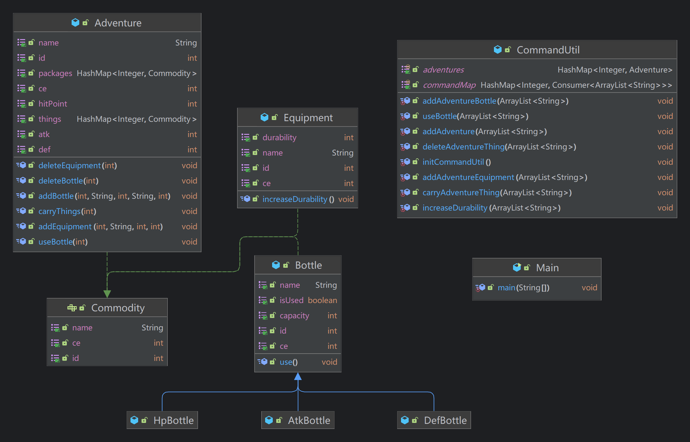
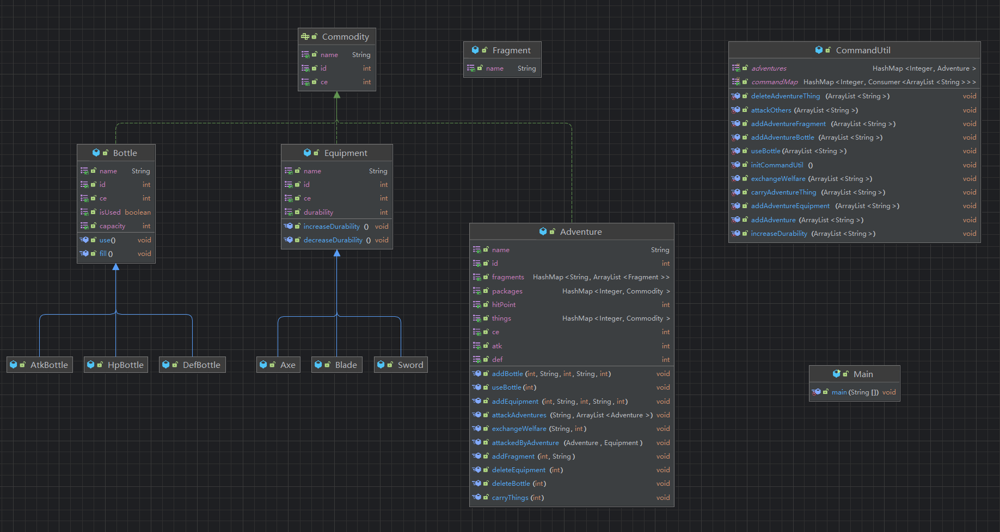
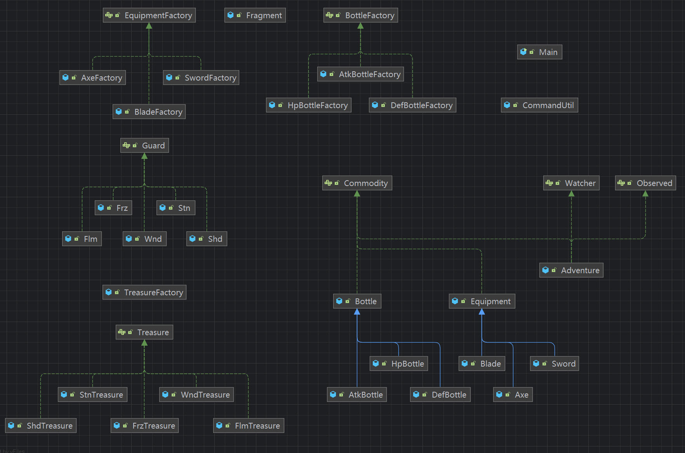

# 2024 BUAA-OOpre课程总结 😘
## 架构设计 😚😚😚

### 这是我第三次作业时的架构类图

- 在这个时候，我已经开始使用 `CommandUtil` 类开始管理命令的输入与解析了，其中的主要思想是使用函数式接口`Consumer`和对应的命令编号数字相对应，组成一个`Hashmap`，这样一来便可以节约大量的`switch case`语句的使用，**也更方便于后续指令的拓展**
- 这个时候我也开始统一使用顶层接口 `Commodity` ，让 `Equipment` 和 `Bottle` 以及 `Adventure` 去分别实现这个接口，让架构更加清晰



### 这是我第五次作业时的架构类图



这个时候相比于第三次作业，我增加了 `Axe` 和 `Blade` 以及 `Sword` ，他们继承于 `Equipment` 类，然后增加了碎片类`Fragment`

### 我最终的架构类图



相比于前几次的更改，这一次作业的最主要改变是

- 增加了观察者模式`Watcher` `Observed`接口
- 增加了装备类，宝物类和水瓶类的工厂模式

这样一来便更符合面向对象设计模式的理念

## Junit心得体会 😨😨😨

### 作业中的Junit使用

在前几次作业的时候，我还是非常规范的使用Junit来测试每一个方法的，但是到了后面，因为每一次作业迭代的东西越来越多，新增的方法和重构也越来越多，所以说<u>到了后面我直接只测试了main方法</u>。🫥🫥🫥

虽然说在数据量足够的情况下，还是可以通过Junit的覆盖率要求的，但后面几次强测的结果也说明了这种方式是不可取的，在下学期的OO正课里，我希望我还是可以**认真的写Junit来保证每一个方法的正确性**。👿

### Junit学习

我发现，在写Junit的时候，我一般只会使用`@Test`注释去测试方法，这种方式在大量的方法测试需求下是耗时耗力的（<u>因为要不断去实例化一些重复的类</u>），我希望可以在后面的学习可以多尝试使用类似于`@Before`和`@After`之类的高级测试方法。🥰

## OOPre的心得体会 😋😋😋

在学习OOpre的短短九周时间里面，不仅让我们从面向过程编程的思维转变为面向对象编程的思维，也让我们学会到了很多知识：JAVA、Junit、Git、Checkstyle等等

同时，我这里也会总结一些在写OOpre中易错的地方（详细的每次作业的总结可以查看GitHub仓库 https://github.com/cjhCoder7/BUAA_OOpre）

> - homework5：在使用HashMap遍历并进行删除时，没有使用迭代器导致了程序运行时出错 （在数据量不大的情况下，JVM是有可能对此进行优化的，所以不要过度依赖于课下小数据的测试）
> - homework6：指导书阅读不清晰，在阅读指导书的时候，一定不要遗漏任何一句话，甚至连顺序都不要弄反，否则就有可能像我一样在第六次作业强测的时候错一半 😭😭😭

### JAVA小心得

#### JAVA8中流`Stream`的使用

可以大量节约代码的行数

原代码为

```java
int maxDef1 = 0;
for (Adventure adventure : attacks) {
    if (adventure.getDef() > maxDef1) {
        maxDef1 = adventure.getDef();
    }
}
```

可以更改为

```java
int maxDef1 = attacks.stream().mapToInt(Adventure::getDef).max().orElse(0);
```

#### JAVA将结果输出到文件中

在 Main 类里这样使用

```java
PrintStream ps = new PrintStream("D:\\1.txt");
System.setOut(ps);
// …… 你的程序
ps.close();
```

#### 多使用迭代器，我感觉只有好处，没有坏处 😋

## 对OOPre课程的简单建议 🫡🫡🫡

希望可以在之后的课程设置里面**<u>多鼓励大家自己构造评测机，写代码构造评测数据，甚至我认为出一些教程也是可以的</u>**。

这样不仅可以让同学们可以更有把握通过强测，也可以让大家在之后的OO正课的学习中体会到Hack的乐趣😉😉

