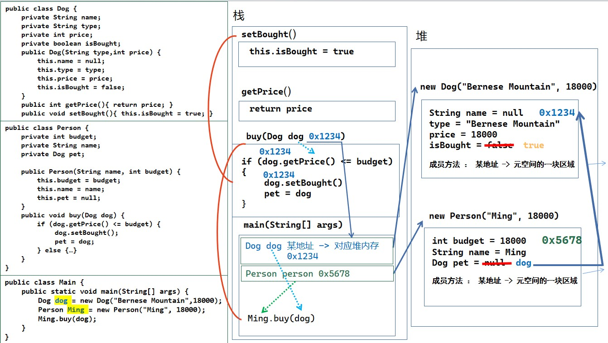
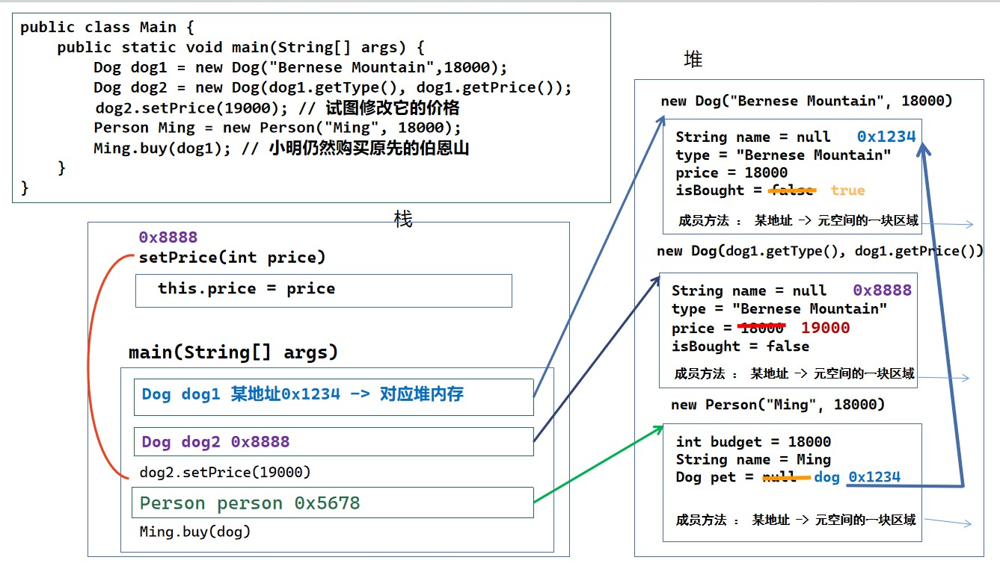
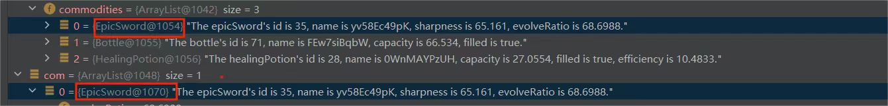

## Part 0. 测试说明 && Junit要求 🤣

本次作业不设置`junit`覆盖率要求！同学们仅需提交功能代码即可。同时本次作业不设置强测。

## Part 1. 训练目标 😘

- 掌握 Java 程序的 Bug 分析以及调试

## Part 2. 预备知识 😶‍🌫️

在本次作业中，我们希望同学们能掌握深克隆和浅克隆的用法。在此之前，我们来了解一下 Java 的内存情况

### 浅析 Java 的内存情况

JVM 的内存划分为 5 个部分：虚拟机栈、堆区、元空间、本地方法栈、程序计数器。其中前三个比较重要，后两个和 JVM（java virtual machine）的运行调度有关，感兴趣的同学可以课下自行了解。

- 栈（stack）：**栈**中存放方法中的局部变量，方法的运行一定要在栈中进行。栈内存的数据用完就释放。 *这里简单称为栈，但实际上是 JVM 栈，Java 虚拟机栈*
- 堆（Heap）：**堆**是 Java 虚拟机中最大的一块内存区域，用于存储对象实例。通俗的理解，就是我们 **new出来的** 所有对象和数组，都是存放在堆中的。
- 元空间(MetaSpace):虚拟机加载的类信息、常量、各类**方法**的信息。

> **jdk1.8**之前元空间又作方法区(Method Area)，相比元空间，方法区额外存储 .class 二进制文件，虚拟机加载的静态变量等数据。**jdk1.8**及之后，类的元信息被存储在元空间中。相比方法区，元空间使用与堆不相连的本地内存区域。所以，理论上不会出现永久代存在时的内存溢出问题。

### 对象的内存图

回到第一次作业中的小狗案例中

```java
public class Dog {
   private String name;
   private String type;
   private int price;
   private boolean isBought;

   public Dog(String type, int price) {
       this.name = null;
       this.type = type;
       this.price = price;
       this.isBought = false;
   }

   public String getType() {
       return type;
   }

   public void setName(String name) {
       this.name = name;  
   }

   public int getPrice() {
       return price;
   }

   public void setBought(boolean bought) {
       this.isBought = bought;
   }

   public void setPrice(int price) {
       this.price = price;
   }
}

public class Person {
   private int budget;
   private String name;
   private Dog pet;

   public Person(String name, int budget) {
       this.budget = budget;
       this.name = name;
       this.pet = null;
   }

   public void buy(Dog dog) {
       if (dog.getPrice() > budget) {
           System.out.println(name + " fails to buy "+ dog.getType());
       } else {
           System.out.println(name + " buys " + dog.getType());
           dog.setBought(true);
           dog.setName("Puppy");
           this.pet = dog;
       }
   }
}

public class Main {
   public static void main(String[] args) {
       Dog dog = new Dog("Bernese Mountain",18000);
       Person Ming = new Person("Ming", 18000);
       Ming.buy(dog);
   }
}
```



- 首先，程序会将 `main` 方法压入调用栈中。
- 在 `main` 方法中声明了一个局部变量 `Dog dog` ，该变量同样被放置在调用栈中。接下来，我们使用 `new` 关键字创建了一个小狗对象，并将其存储在堆中的一块内存空间中，然后将堆中对应的地址存储在调用栈中。这个堆中的内存用于存储小狗的属性，而堆中的成员方法只保存一个地址，指向元空间中实际内容的位置。
- 同样的操作也适用于 `Person person = new Person(…)` , 创建一个 `person` 对象并将其地址存储在调用栈中。
- 接下来，调用 `Person` 类的 `buy` 方法并将 `dog` 作为参数传入，实际传入的内容就是调用栈中`dog` 变量所存内容，即`dog`在堆中的地址。
  - `buy` 方法被压入调用栈中。
  - 在 `buy` 方法中，首先调用了 `Dog` 类的 `getPrice()` 方法。
  - `getPrice()` 方法被压入调用栈中。
  - 通过 `dog` 在堆中的地址，找到对应的属性 `price` 并将其作为结果返回。
  - `getPrice()` 方法结束，弹栈。
  - 然后调用了 `Dog` 类的 `setBought()` 方法。
  - `setBought()` 方法被压入调用栈中。
  - 通过 `dog` 在堆中的地址，找到对应的成员方法，并在元空间中执行该方法对应的程序代码，即将 `dog` 在堆中的属性 `isBought` 修改为 `ture`。
  - `setBought()` 方法结束，弹栈。
  - 最后，将 `dog` 作为参数继续传递给 `Ming` 在堆中的属性 `pet`，即将 `dog` 在堆中的地址存储在 `pet` 中。
  - `buy` 方法结束，弹栈。
- 当 `main` 方法中的所有内容执行完毕，会从调用栈中弹出 `main` 方法，程序结束运行。

### 深克隆和浅克隆

在对 Java 的内存机制有了初步了解后，我们继续来学习浅克隆和深克隆的知识。

#### 浅克隆

我们来看一个例子，宠物店又新进了一只伯恩山，但是这只伯大脚的品相更好，商家决定将它的价格设置为 19000，其他条件同 1 号小伯一样。 我们简单修改前序代码的 main 方法为

```java
public class Main {
   public static void main(String[] args) {
       Dog dog1 = new Dog("Bernese Mountain",18000);
       Dog dog2 = dog1; // 试图增加一只新的伯恩山
       dog2.setPrice(19000); // 试图修改它的价格
       Person Ming = new Person("Ming", 18000);
       Ming.buy(dog1); // 小明仍然购买原先的伯恩山
   }
}
```

重新执行这份代码，我们发现，小明购买失败了！ 程序输出

```txt
Ming fails to buy Bernese Mountain
```

出现这样的结果是因为：在修改 dog2 的价格时，连同 dog1 的价格一并修改了。而造成这样结果的原因是因为上面的程序只是对**引用**进行了克隆。
执行 `dog2 = dog1` 时，我们传递的给 dog2 的，是 dog1 在堆内存中的内存地址，所以 dog2 和 dog1 指向了相同的堆内存。通俗来讲，本质上 dog1 和 dog2 就是同一条狗。所以不论是修改哪条狗的参数，结果均是执行/修改 0x1234 这块内存的内容。

> **知识补充-基础数据类型&引用类型的传递方式** 基础数据类型为值传递，引用数据类型为引用传递。 基础数据类型（int、boolean）在作为参数传递时，传递的是真实的数据，形参的改变，不影响实参。 引用数据类型（类、数组、接口）作为参数传递时，传递的是堆内存中的地址，形参改变，实参也改变。

而上述这种克隆过程，在 Java 术语中可以解释为，我们在程序中创建了一个 **Dog 实例** ，使用 **`dog1` 引用** 了这个实例。之后声明的 **`dog2` 变量** ，重新引用了 `dog1` 引用的实例。因此在整个程序运行过程中，仅有一个实例。故当我们使用这两个引用中任意一个引用来对其实例进行修改时，会在使用另一种引用访问该实例中体现出来。

这种只克隆引用的克隆过程，称为 *浅克隆* (Shallow copy)。如果希望创造出一个“完整”的克隆，我们不仅要在编码时创建一个新的引用，还要创建一个新的实例，即，创建出另一块堆内存，使得二者互不干涉，互不影响。

#### 深克隆

我们继续修改前序代码的 main 方法为

```java
public class Main {
   public static void main(String[] args) {
       Dog dog1 = new Dog("Bernese Mountain",18000);
       Dog dog2 = new Dog(dog1.getType(), dog1.getPrice());
       dog2.setPrice(19000); 
       Person ming = new Person("Ming", 18000);
       ming.buy(dog1); // 小明购买原先的伯恩山
   }
}
```

重新执行这份代码，我们发现，小明成功购买到了自己想要的伯恩山！ 程序输出为

```txt
Ming buys Bernese Mountain
```

这种克隆引用和实例的克隆过程，称为 *深克隆* (Deep copy)。 同学们举一反三，是否也能领悟到深克隆在内存图中的对应效果了呢？



#### 容器中的克隆

在之前的两次作业中，同学们已经学会了容器的基本使用方法。容器提供了管理多个对象的方法，字如其名，容器中“容纳了若干个对象”。在进行容器克隆时，深浅克隆的区别将更大

我是一个对象，我既可以是计算机学院管理的对象，也可以是北京市大学生管理的对象，也可以是北京航空航天大学管理的对象。那么进行迁移我们发现，一个对象当然可以在不同的容器中被管理。 那么容器管理的自然就不能是实例了，他必须是若干实例的引用。因此在对容器进行克隆时需要额外谨慎。

因此如果需要对一个容器进行深克隆，我们**一定要遍历容器中的所有对象，对每个对象都进行深克隆**

### idea 的调试功能介绍

本次作业我们期待大家能够完成一份程序的修改工作。我们简单介绍几个 idea 里经典的调试方法

- 打印输出: 这是一种最基本且常用的调试方法。你可以在代码中插入输出语句，将关键变量的值打印到控制台或日志中，以便观察和分析程序的执行状态。
  - 优点：简单易用，适用于小规模项目和简单问题。
  - 缺点：当程序规模较大或问题复杂时，输出信息可能混乱不清，不便于定位问题。
- 断点设置: 在调试工具中设置断点，是一种常用的调试手段。断点是在程序中指定的一个位置，当程序执行到该位置时会暂停执行，你可以逐行或逐步跟踪代码的执行过程，观察变量的值，帮助找出问题所在。
  - 优点：直观，能够精确控制程序的执行流程；

> 深克隆小贴士
>
> 
>
> 当我们在对一个容器进行深克隆时，如果想要判断是否真的对容器中的每个引用都进行了深克隆，可以在调试器中看克隆前后对象后的数字。如果克隆前后对象的数字不同，且这两个对象的属性（包括容器/数组内容）后面的数字均不同，那么就可以认为我们彻底完成了该对象的深克隆。
> **知识补充-object ID** 这串数字是 JVM 上报的 objectID。他唯一标识了 JVM 中的对象。除非已显式处置 ObjectID（我们不会用到），否则不会重复使用 ObjectID 来标识不同的对象，而不管引用的对象是否已被垃圾回收。objectID 为 0 表示空对象。

- 调用栈回溯: 当程序出现异常或错误时，调用栈会记录程序的调用层次关系，可以通过查看调用栈来定位问题所在。调用栈回溯是一种非常有用的调试技术，你可以追溯到程序执行的起点，逐层检查调用的参数和返回值，找到出错的源头。
  - 优点：可以快速定位问题，尤其是在异常情况下；
  - 缺点：调用栈可能很长，需要仔细分析和理解。

### 常见 bug 介绍

经历了之前的迭代开发，我们的作业代码已经成为一个具有一定复杂度的体系了。但是，前几次的作业中，我们可能因为各种各样的原因，犯了各种各样的错误。

因此这次作业，我们停下脚步，暂时搁置一下我们原有代码的开发，来关注一下伴随着程序员每一份代码的头疼话题：bug

在接下来的内容中，我们将介绍一些需要注意的，在代码编写的过程中可能产生 bug 的部分。**这些东西可能会在你的作业中用到，按照以下 bug 出现的特征和位置来寻找可能出现 bug 也许是个好主意**

#### 深浅克隆

本次指导书的前面一大部分都在说明这个问题，因此在此不再赘述。要减少此类bug，你需要对其本质有深刻的理解。

#### 对象：==/equals?

==和equals不是一个意思！！！！

为了更好地使同学们理解，不妨先看一个例子，假设现在有这样一个 Dog 类

```java
public class Dog {
    private String name;

    public Dog(String name) {
        this.name = name;
    }
}
```

它定义的属性仅仅有 name 一个。你可能会觉得，这个 name 就是这个类的全部了，若两个对象的 name 相等，那这两个对象对外的表现应该完全一样，应该也是相等的。

```java
Dog dog1 = new Dog("jiwawa");
Dog dog2 = new Dog("jiwawa");
System.out.println(dog1 == dog2);
```

但是如上输出得到的结果却是：false。这说明，事实上两个 dog 并不相等，为什么？

这是因为，对于`==`而言，假如其两边的都是对象，它返回的布尔值将指示这两个对象是否为同一个对象。

显然，经过上述深浅拷贝的学习后，由于 `dog1` 和 `dog2` 都是通过 new 操作得到的对象，同学们一定能清楚地意识到，它们分别是一个单独存在的、崭新的对象，显然是不相同的。因此这个布尔表达式的值是 false 。更直观的，可以通过 print 对象观察到这点：

```java
Dog dog1 = new Dog("jiwawa");
Dog dog2 = new Dog("jiwawa");
System.out.println(dog1);
System.out.println(dog2);
```

其输出赫然不同，这就是**两者非同一对象**的有力证明：

```java
Dog@16d3586
Dog@154617c
```

那么，应该如何判断对象的所有属性相同？答案是：需要专门实现一个判断的方法：`equals`。

```java
public boolean equals(Dog dog) {
    return this.name == dog.name;
}
```

此时再次尝试 print：

```java
System.out.println(dog1.equals(dog2));
```

输出为 true，达到了期望的效果。

由上述可知，**当要求为“判断两者是否为同一个对象”时，应使用`==`。而当要求为“仅仅需要判断两者的某些属性是否相等”时，应使用 equals（这些属性可以在 equals 方法中自由定义）**。

事实上，`==`也可以出现在按值判断比较的情景下，但只有在**比较基本类型（以下八种）**时，才是在比较两个变量保存的数据是否相等：


`byte`，`char`，`short`，`int` ，`long`，`float`，`double`，`boolean`


与此同时，这些属性对应的类，例如int 对应的integer也满足`==`比较的性质。

##### 神奇的类：String

现在再来回顾刚才的代码：

```java
this.name == dog.name;
```

会发现，`String`其实并不在这八种基本类型之中，它本身也是一个类，而"12345" 它也是一个对象，那么为什么`==`就能生效了？

`String` 是个很神奇的类，我们写：

```java
String str = "12345";
```

的时候，似乎没有使用 new。

事实上，字符串对象，假设不通过 new 方法创造，它是被放在一个叫做“字符串常量池”的地方，和我们创建对象所用的堆区并不是在一起的。

当检测到字符串 "12345" 的时候，首先 jvm 会检查在这个字符串常量池中有没有 “12345” ，假设不存在的话，就在字符串常量池里面创造一个这样的对象，并把它的引用传递回来。

也就是说，"12345"==“12345”，这两个 “12345” 本身指代的就是同一个在字符串常量值里的对象。

而通过以下这种直接`""`的方式，引用的都是同一个对象"jiwawa"，自然就相等了。

```java
Dog dog1 =new Dog("jiwawa");
Dog dog2= new Dog("jiwawa");
```

当然，只要是对象，这里都推荐用 `equals` 判断其内容是否相等，`String` 也不例外。在今后的学习中，你可能会遇到因为盲目用==判断字符串而产生的 bug，例如用 `new String("12345") == "12345"`的值是 false，这是因为 new 了之后就会在堆区新建一个字符串对象，更多深入的知识，还请同学们感兴趣的自己查阅资料。

##### Map接口的实现如何比较key的相等性？

先给出结论：在Java中，判断Map的key是否相等，应该使用`equals()`方法而不是`==`操作符。

Map接口的实现，特别是像HashMap这样的基于哈希表的实现，需要能够准确地判断两个键是否等价（即内容相同），以便能够正确地存储和检索键值对。因此，它们会依赖于键对象的`equals()`方法和`hashCode()`方法来确保键的唯一性和等价性。

- `equals()`方法：用于比较两个对象的内容是否相等。如果两个对象通过`equals()`方法比较为相等，那么它们的`hashCode()`方法也必须返回相同的整数值。
- `hashCode()`方法：用于获取对象的哈希码。Map实现利用哈希码来快速定位键的位置。

#### scanner.next系列

scanner 是一个 java 为我们提供的类，搞清楚里面的常用方法是必要的，否则会闹出乌龙。

想必在前面的作业中同学们已经掌握了其中一些常见的方法了，这里也不再赘述。这里希望同学们能再次加深对 scanner.next() 和 scanner.nextLine() 两个方法的认识。

#### 遍历容器：迭代器删除

这个问题似乎没有前面的那些隐晦，因为它不需要你去专门的 debug，一旦出现这个行为，程序运行就会因为异常而停止。

在前面的作业中遍历容器的过程中，可能用到的是 ArrayList 的索引，当然也有同学使用的是 hashmap 这种没有“第几个”说法的容器，就可能会用到 for 增强循环：

```java
for (Adventure adventure:adventure)
```

其实它的本质是用迭代器遍历

```java
Iterator<Dog>iterator= arrayList.iterator();
while (iterator.hasNext()){
       Dog dog=iterator.next();
       //....
}
```

一个很经典的错误是边遍历边删除：

```java
ArrayList<Dog> arrayList=new ArrayList<>();
arrayList.add(new Dog("dog1"));
arrayList.add(new Dog("dog2"));
arrayList.add(new Dog("dog3"));
for (Dog dog:arrayList){
     arrayList.remove(dog);
}
```

运行这个会报错：

```java
Exception in thread "main" java.util.ConcurrentModificationException
at java.util.ArrayList$Itr.checkForComodification(ArrayList.java:911)
at java.util.ArrayList$Itr.next(ArrayList.java:861)
```

如果用迭代器翻译过来，也会有相同报错。

```java
Iterator<Dog>iterator= arrayList.iterator();
while (iterator.hasNext()){
    Dog dog=iterator.next();
    arrayList.remove(dog);
}
```

用一个浅显但不太精确的解释，这是因为在上述使用的删除中，使用的是 ArrayList，也就是容器本身的删除方法，它确实能修改容器的状态，但是它不能修改迭代器的状态，这导致，迭代器的状态和当前 ArrayList 的状态，不相同了，而它在每次 next() 的时候会判断这个状态是否相同，导致报错。

我们可以进入相关源代码查看内容，右键代码中的 `hasNext()` 函数，转到-实现-Itr(ArrayList)那一行，点击跳转。

```java
private class Itr implements Iterator<E> {
        int cursor;       // index of next element to return
        int lastRet = -1; // index of last element returned; -1 if no such
        int expectedModCount = modCount;
        //....
}
```

往上划，我们可以看见定义 Iterator 的一些参数，我们现在关心第三个。

```java
public E next() {
            checkForComodification();
            //.....
}
```

往下划，在next的最前面，执行了这个函数：

```java
final void checkForComodification() {
            if (modCount != expectedModCount)
                throw new ConcurrentModificationException();
}
```

正是这个函数实现了异常的抛出。

而容器的 `.remove()` 方法修改它的地方在(转到-实现-ArrayList)：

```java
private void fastRemove(int index) {
        modCount++;
        //.....
}
```

正是这个导致了异常的发生。

那么，如何避免这个错误呢？

迭代器本身提供了删除的一个方法：

```java
Iterator<Dog>iterator= arrayList.iterator();
while (iterator.hasNext()){
       Dog dog=iterator.next();
       iterator.remove();
       System.out.println(dog.name);
}
```

小结如下：

- 遇到删除的不使用 for 循环，而使用迭代器遍历，删除的时候使用迭代器的删除方法
- 将删除和遍历分开，比如把要删除的对象用一个容器先存起来，遍历后统一删除。
- 在今后的学习或者探索中发现其他方法

#### index

众所周知，String 对象有一个方法叫做 `substring`，它有多种使用方式，像这样：

```java
String str1 = "012345".substring(1,3);
String str2 = "012345".substring(1);
```

注意，下面的1指的是默认为 `beginIndex`，就是 str2[1] 开始截取，包括 str2[1]（当然，和 C 语言一样，首元素是 a[0] ）

将两个字符串分别输出，输出结果是：

```
12
12345
```

会发现，`substring(1,3)`只返回了 1 和 2 。这是因为，该方法表示方式类似数学中的区间[1,3)，左闭右开， 3 是取不到的。

关于 index 还会有其他的 bug 出现例如：

- 假设字符串长度为n，则最后一个的 index 是n-1
- 假设在循环里面使用的是 a[i],a[i+1] 这种，循环变量 i 不能取 n-1，否则会出现 a[n] 报错

## Part 3. 题目描述 😁

### 背景介绍

本次作业的代码将不会和之后的作业有任何开发关系，仅仅为了同学们巩固本次课的内容所用。其中涉及的容易产生 bug 的操作，同学们将来可能会用到，也可能会选择其他方法替代。但是请同学们在本次作业中理解清楚这些 bug 背后的原理，为课程组的代码 debug 。同时，为了达成课程的统一性，我们将采取和前几次作业同样的世界观。

在古老的魔法图书馆中，馆长获悉一群冒险者正在寻求强大的魔法知识。为帮助他们更好地吸收这些宝贵的知识，馆长决定从馆藏中精选出具有特殊魔咒的书籍，并将这些书籍系统化地整理到书架中，以便有效地支持冒险者的学习与探索。现在请你帮助馆长管理和组织这些书籍。

以下提到的属性 **魔咒** 是一个字符串，它是书籍的力量之源，决定了书籍的魔法强度。馆长可以通过修改书籍的魔咒来管理和强化这些书籍。

为了方便你进行管理，馆长向你介绍了它设想的书架和它掌握的相关魔法：

- **书籍（Book）**：拥有属性 **名字（name）**，以及 **魔咒（magic）**。
- **书架（Bookshelf）**：拥有属性 **编号（id）**，以及一个存储书籍的容器。
- 馆长能使用的魔法有：
  1. 制作一本新的书籍。
  2. 将若干本未被编入书架的书籍编入一个新的书架。
  3. 复制一个已经存在的书架。
  4. 对某个书架进行筛选，移除不符合标准的书籍。
  5. 将一个书架的所有书籍并入另一个书架。
  6. 批量增强书架中所有书籍的魔咒。
  7. 批量截取书架中所有书籍的魔咒。
- 同时，为了方便你随时查看书架的状态，馆长还为你提供了这些查询功能：
  1. 统计编号为 x（由输入提供）书架的书籍数量（统一编号为 8）。
  2. 统计编号为 x（由输入提供）书架中魔咒字符串中包含 str（由输入提供）的书籍数量（统一编号为 9）。
  3. 统计未被编入书架的书籍数量（统一编号为 10）。

在本次作业中，你需要完成的任务是：

- 对馆长提供的代码进行分析和调试，从而找到其中的错误，修复错误以通过测试。

### 题目说明

在本次作业中，初始情况下，图书馆没有任何书籍，你将通过输入指令来指挥馆长的行为。

以下是对指令的详细说明：

1. 无特殊说明。

2. 无特殊说明。

3. **复制的定义**：对于两个对象 A，B，当 A，B 满足以下要求时，我们称两者满足复制关系：

   两个对象**不是同一个**（由 `System.out.println()` 输出后 @ 的编号不同），但对于其每一个属性 A：

   - 若该属性 A 为基本数据类型（如 `int`, `double` 等）或字符串，则两者该属性 A 相等；
   - 若该属性 A 为对象，两个对象的属性 A 满足复制关系。

4. **筛选规则**：查看书籍的魔咒，输入会提供一个整数，记作标准合格度。书籍的标准合格度为其**魔咒字符串**中满足**特定条件 C** 的不同**子串数目**（两个子串相同当且仅当两个子串的起止下标均相同）。

   特定条件 C 的定义为：字符串 s 满足特定条件 C 当且仅当 s 以 `#` 开头并以 `#` 结尾，且 s 中 `#` 字符的个数为 `2`，同时 s 中包含至少一个数字字符，并且数字字符的总个数不少于字母字符的个数。

   该魔法将所有合格度**小于**标准合格度的书籍**移除**。

   **示例-\*EXAMPLE\***

   例如一本书籍的魔咒为"#A12#bcd#345#Z#"：

   - \#A12#（`2` 个数字字符，`1` 个字母字符，成立）；
   - \#bcd#（不成立，因为没有数字字符）；
   - \#345#（成立）；
   - \#Z#（不成立）。

   因此合格度为 `2`。

5. **规则**：设将编号为 id2 的书架并入编号为 id1 的书架中，合并后书架的编号仍为 id1，id2 书架被取消（id2 原本的书籍不再从属于 id2，而是从属于 id1 书架）。同时，若两个书架中存在一模一样的书籍（**定义：两者名字完全相同，魔咒字符串也完全相同**），则合并后的书架中仅保留其中一本书籍。

6. **规则**：给定一个字符串，将书架中所有书籍的魔咒末尾加上该字符串。

7. **规则**：将指定 id 的书架内所有书籍的魔咒更新为各自魔咒字符串进行 `a，b` 截取后的结果。本指令依次输入两个非负整数 a，b（不保证 a，b 的相对大小关系），定义 `对字符串 s 进行 a, b 截取` 操作：

   - 若 `a <= b` 则得到字符串 s 中从下标 `a` 到下标 `b` 的部分（包括下标 `b` 位置的字符）。若 `a` 超出 s 的下标范围，则得到空串；若 `b` 超出 s 的下标范围，则截取到 s 的末尾即可。
   - 若 `a > b` 则得到空串。

8. 无特殊说明。

9. 无特殊说明。

### 输入输出格式

第一行一个整数 *n*，表示操作的个数。接下来的 n 行，每行一个形如 `{type} {attribute}` 的操作，`{type}` 和 `{attribute}` 间、若干个 `{attribute}` 间使用**若干**个空格分割。操作输入输出形式及其含义如下。具体要求也在下表中列出：

| 类型 | attribute                                              | 意义                                                         | 输出（单独成行） |
| ---- | ------------------------------------------------------ | ------------------------------------------------------------ | ---------------- |
| 1    | `{name}` `{magic}`                                     | 制作一本名字为 `{name}` 的书籍，其魔咒为 `{magic}`           | 无               |
| 2    | `{id}` `{num}` `{name1}` `{name2}`….（共 num 个 name） | 将 num 本未被编入书架的书籍 `{name1}`-`{nameN}` 编入编号为 `{id}` 的书架 | 无               |
| 3    | `{id1}` `{id2}`                                        | 复制编号为 `{id1}` 的书架，新复制出来的书架编号为 `{id2}`    | 无               |
| 4    | `{id}` `{int}`                                         | 对编号为 `{id}` 的书架进行筛选，标准数值为 `{int}`           | 无               |
| 5    | `{id1}` `{id2}`                                        | 将编号为 `{id2}` 的书架并入编号为 `{id1}` 的书架             | 无               |
| 6    | `{id}` `{str}`                                         | 将编号为 `{id}` 的书架中的所有书籍的魔咒末尾加上 `{str}`     | 无               |
| 7    | `{id}` `{int1}` `{int2}`                               | 将编号为 `{id}` 的书架中的所有书籍的魔咒更新为各自魔咒进行 `{int1}`,`{int2}` 截取后的字符串 | 无               |
| 8    | `{id}`                                                 | 统计编号为 `{id}` 的书架的书籍数量                           | `{一个整数}`     |
| 9    | `{id}` `{str}`                                         | 统计编号为 `{id}` 的书架中魔咒包含子串 `{str}` 的书籍数量    | `{一个整数}`     |
| 10   | （此处无输入）                                         | 统计未被编入书架的书籍数量                                   | `{一个整数}`     |

### 数据限制

在其中，所有输入中提到的要被操作的书架的 id 均保证已存在（除了"复制书架指令"中的新 id 是本次复制之前不曾存在过的 id）。

1. 保证此方法生成的书籍名字均不相同。
2. 保证提到的书籍均存在且未被编入书架。
3. 保证复制生成的书架 id 在本次复制之前不曾存在过。
4. 筛选标准满足：[0,100]。

### 变量范围

| 变量    | 类型   | 说明                              |
| ------- | ------ | --------------------------------- |
| `id`    | 整数   | 取值范围：0 - 2147483647，无前导0 |
| `name`  | 字符串 | 保证不会出现空白字符              |
| `magic` | 字符串 | 保证不会出现空白字符              |

### 样例

**输入**

```
12
1 BookA #123#abc#
1 BookB #12#def#456#
1 BookC #xyz#789#abc#
2 1 3 BookA BookB BookC
3 1 2
4 1 1
5 1 2
6 1 @magical
7 1 0 4
8 1
9 1 456
10
```

**输出**

```
3
0
0
```

## 总结 💕❤️😍

本次作业没什么好说的，就是一个关于代码 Bug 的审查工作，要注意的就是`拷贝`和`substring下标`的一些要点哦，需要仔细审查，顺便可以自己编写一些测试样例来验证修改的正确与否。🥰😋😋😎

对于我自己而言，是在`substring`下标上吃了不少苦头的。😇😭😭😭😇