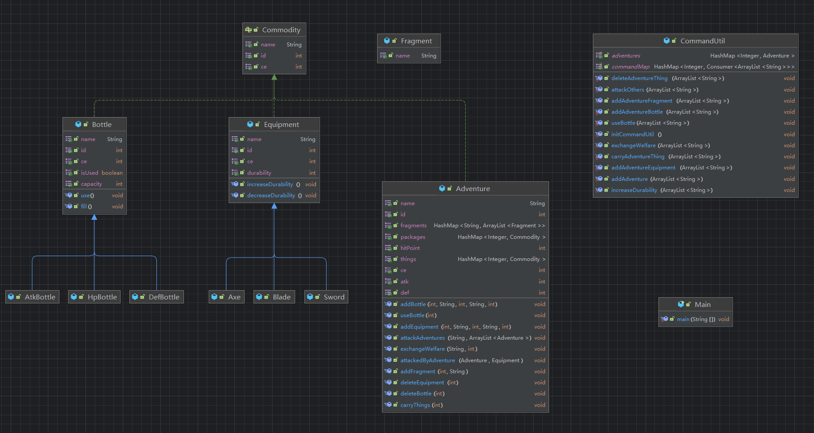

## Part 0. 提交要求 && Junit要求 🤣

请保证提交项目的顶层目录存在两个文件夹：`src`和`test`（命名需严格与此保持一致），请将作业的**功能代码**存放于`src`文件夹下，同时将相关**junit测试类代码**文件存放于`test`文件夹下，以保证评测的正常进行（评测时**只会**针对`src`目录下的文件进行程序**功能**的评测以及代码风格检测，也就是说，`test`目录下的junit测试代码风格不会被检测）。参考目录结构如下：

```plaintext
|-src
  |- Bottle.java
  |- Equipment.java
  |- ...
|-test
  |- BottleTest.java
  |- EquipmentTest.java
  |- ...
```

本次作业，要求Junit测试覆盖率**保证**`method >= 90％`，`line >= 60%`， `branch >= 60%`。（`idea`显示的覆盖率和`评测`测到的覆盖率可能略有差别，请同学们以评测为准）

## Part 1. 训练目标 😘

- 学习并掌握“管理对象”-**容器**，熟悉 ArrayList 、HashMap 、HashSet 的使用
- 掌握对象的层次结构，通过编写更多的类进行类的层次结构的理解

## Part 2. 预备知识 😶‍🌫️

在第二次作业中，我们学习了容器的知识，并掌握了 ArrayList 的基本用法。在本次作业中，我们将介绍两个新的“容器”——`HashMap`、`HashSet`。

### `HashMap`

HashMap 是一个散列表，它存储的内容是键值对 (key-value) 映射。区别于 ArrayList 的有序性，HashMap 是无序的，即不会记录插入的顺序。

```java
/* HashMap 类位于 java.util 包中，使用前需要引入它，语法格式如下：*/
import java.util.HashMap; // 引入 HashMap 类

public class HashMapSample {
    public void sample () {

        /* 1. 创建HashMap */
        /* HashMap<引用类型Key,引用类型Value> 哈希表名mapName = new HashMap<> */
        HashMap<Integer, Bottle> bottles = new HashMap<>(); // bottle's id => bottle

        Bottle bottle1 = new Bottle(/*parameters*/);
        Bottle bottle2 = new Bottle(/*parameters*/);

        /* 2. 向HashMap内加入一个元素 */
        /* 数组名mapName.put(引用对象key,引用对象value) */
        bottles.put(12345,bottle1);
        bottles.put(bottle2.getId(),bottle2);

        /* 3. 访问HashMap中key值对应的value */
        /* 哈希表名mapName.get(key) */
        Bottle bottle = bottles.get(12345); // == bottle1

        /* 4. 检查HashMap中是否存在指定的 key 对应的映射关系。 */
        /* mapName.containsKey(key) */
        if (bottles.containsKey(12345)) { // true
            System.out.println("We have such a bottle!");
        }

        /* 5. 检查HashMap中是否存在指定的 value 对应的映射关系。*/
        /* mapName.containsValue(value) */
        if (bottles.containsValue(bottle2)) {
            System.out.println("We have such a bottle!");
        }

        /* 6. HashMap大小, 即键值对数目 */
        /* 数组名mapName.size() */
        int size = bottles.size();

        /* 7. 遍历HashMap中的所有元素 */
        for (int key : bottles.keySet()) { // keySet可以获取HashMap容器中所有 key 组成的对象集合
            System.out.println("bottle's function is " + bottles.get(key).getName());
        }

        for (Bottle value : bottles.values()) { // values可以获取HashMap容器中所有 value 组成的对象集合
            System.out.println("bottle's function is " + value.getName());
        }

        /* 8. 删除一个映射关系 */
        /* mapName.remove(key) */
        // bottles.containsKey(12345) == true
        bottles.remove(12345); // true
        // bottles.containsKey(12345) == false


        /* 9. 删除一个键值对
        /* mapName.remove(key, value) 键值对能被删除的条件为：当且仅当HashMap存在该 key-value 键值*/
        // bottles.containsKey(bottle2.getid()) == true
        bottles.remove(bottle2.getid(), bottle1); // false
        // bottles.containsKey(bottle2.getid()) == true 此处仍然为真！
        bottles.remove(bottle2.getid(), bottle2); // true
        // bottles.containsKey(bottle2.getid()) == false; 
    }
}
```

### `HashSet`

HashSet 是基于 HashMap 来实现的，是一个**不允许有重复元素**的集合，同时也允许有 null 值的出现。同 HashMap 一样，HashSet 也是无序的即不会记录插入的顺序，且 HashSet 中的元素也是对象，常见的基本类型所对应的包装类同 HashMap 相同，此处不做过多赘述。

```java
/* HashSet 类位于 java.util 包中，使用前需要引入它，语法格式如下：*/
import java.util.HashSet; // 引入 HashSet 类

public class HashSetSample {
    public void sample () {

        /* 1. 创建HashSet */
        /* HashMap<引用类型> <setName> = new HashSet<> */
        HashSet<Bottle> bottles = new HashSet<>();

        Bottle bottle1 = new Bottle(/*parameters*/);
        Bottle bottle2 = new Bottle(/*parameters*/);

        /* 2. 向HashSet内加入一个元素 */
        /* 集合名<setName>.add(对象) */
        bottles.add(bottle1);
        bottles.add(bottle2);
        bottles.add(bottle1); // 重复添加的元素不会被加入HashSet中

        /* 3. 检查HashSet中是否存在指定的元素 */
        /* setName.contains(obj) */
        if (bottles.contains(bottle1)) { // true
            System.out.println("We have such a bottle!");
        }

        /* 4. HashSet大小, 即元素个数 */
        /* setName.size() */
        int size = bottles.size();

        /* 5. 遍历HashSet中的所有元素 */
        for (Bottle obj : bottles) {
            System.out.println("bottle's function is " + obj.getName());
        }

        /* 6. 删除HashSet中的指定元素
        /* setName.remove(obj) */
        bottles.remove(bottle2);
    }
} 
```

## Part 3. 题目描述 😁

### 背景

本次作业需在第三次作业的基础上进行进一步开发与拓展，同学们应在完全实现第三次作业的所有功能与代码要求的基础上，沿用其代码框架进行构建。

本次作业的核心要点包括但不限于：

1. **背包功能的完善与物品数量控制**：确保背包能够正确管理并限制各类物品的携带数量。
2. **装备类型的细化与实现**：通过继承机制将装备分为三个子类型，使不同装备具备独特效果。
3. **战斗系统的实现与冒险者属性调整**：引入战斗机制，并根据战斗结果准确调整冒险者及物品的属性。
4. **碎片兑换福利机制的实现**：设计碎片类（Fragment），允许冒险者通过收集碎片兑换特定福利。

### 背包限制

在第三次作业中，我们明确了“携带”的定义：只有当物品归属于某冒险者并位于其背包内时，该物品才被视为被携带。特别规定，若冒险者尝试携带已在背包中的物品，6号指令不会产生任何影响，物品状态保持不变。

本次作业在继承上述定义的基础上，进一步变化且细化了规则，针对不同类型的物品分别制定明确的携带与使用规范。

#### 装备

冒险者只能携带一件同名装备。

若冒险者已经携带了名字为 `sword` 的装备（该装备 `id` 为 1），下一次再尝试携带另一个名字为 `sword` 的不同装备（该装备`id`为 2）时，原本 `id` 为 1 的 `sword` 会被顶替。注意，被顶替的装备依然属于此冒险者。

#### 药水瓶

药水瓶的使用说明与第三次迭代作业一致。

与前述迭代不同的是，冒险者只能携带 `max_bottles` 个同名的药水瓶，其中`max_bottles`的值满足max_bottles=CE/5+1

> **示例-Example**
>
> 若冒险者战斗力为 19, 则 `max_bottles` 的值是 4。假如在这时，该冒险者携带了四个同名药水瓶 `water`，之后再尝试携带同名的药水瓶后时，他的状态不会有任何改变，也不需要输出任何内容，他也不会携带新的同名药水瓶。

### 战斗

首先，鉴于受攻击方可能包含一位或多位冒险者，我们特此明确界定**受攻击方的整体防御能力**：此能力被定义为**受攻击方所有个体防御力中的最大值**，即通过对所有受攻击个体的防御力进行比较后选取的最大值作为该受攻击方整体的防御能力标准。

战斗成功的条件被严格界定为：**仅当攻击者所意图使用的装备已处于携带状态，并且攻击者的攻击力与所携装备所提供的战斗力之和，能够严格大于受攻击方的整体防御能力，方可判定战斗成功**。反之，若不满足上述任一条件，则战斗失败。

> **示例-Example**
>
> 假设存在冒险者 A（攻击力100），冒险者 B（防御力130），以及冒险者 C（防御力160）。若冒险者 A 携带了提供50点战斗力的装备，并意图发起攻击：
>
> - 若 A 攻击 B，由于100（ A 的攻击力）+50（装备战斗力）=150>130（ B 的防御力），故 A 对 B 的战斗成功。
> - 若 A 攻击 C，由于100（ A 的攻击力）+50（装备战斗力）=150<160（ C 的防御力），故 A 对 C 的战斗失败。
> - 若 A 同时攻击 B 与 C，则受攻击方的整体防御能力为160（160>130），由于100（ A 的攻击力）+50（装备战斗力）=150<160，故 A 对 B 与 C 的联合攻击视为失败。

在战斗失败的情况下，所有参与该战斗的冒险者的体力值将保持不变，不发生任何调整。而一旦战斗成功，则根据既定的体力值调整规则，对冒险者的体力值进行相应变化，具体调整方式依据以下相关规则执行。

#### 战斗成功后体力的计算

被攻击者的体力变化受到攻击者所选用装备特性的间接影响。本次作业中 **Equipment（装备）**被明确划分为斧、剑、刀三类，每类装备的特定战斗力值需通过外部输入明确指定。

因此，分析被攻击者体力变化时，需综合考虑攻击者的属性、攻击者所选装备类型及其对应的战斗力值。我们确保战斗结束后，所有相关冒险者的体力值均保持在大于零的安全范围内。

| 类型`type` | 特性                                                         |
| ---------- | ------------------------------------------------------------ |
| `Axe`      | 斧。如果战斗成功的条件被满足，则受攻击者新生命值`hitPoint` = 受攻击者原生命值 / 10。 |
| `Sword`    | 剑。如果战斗成功的条件被满足，则受攻击者损失生命值 `hitPoint_decrease` = `装备的CE` + `攻击者的 atk` - `受攻击者的 def`。 |
| `Blade`    | 刀。如果战斗成功的条件被满足，则受攻击者损失生命值为 `hitPoint_decrease` = `装备的CE` + `攻击者的 atk` 。 |

#### 战斗后耐久度的变化

每当攻击者使用装备 A 参与并完成一次战斗后，装备 A 的**耐久度将按既定规则减少一个单位**，具体计算方式为：装备 A 的新耐久度=装备 A 的原耐久度−1。

值得注意的是，当此减少操作导致装备 A 的**耐久度降至0时**，装备 A 将被视为**已达到报废状态**，并立即从游戏系统中移除，即装备 A 将不再作为可用资源存在于当前游戏环境中，该冒险者将失去对装备 A 的所有权，同时，装备 A 的唯一标识符（id）将不再出现于游戏中。

### 碎片

本次作业引入碎片类（Fragment）。首先需要明确的是**碎片与物品之间的区别**，确保**碎片不被归类为可携带的物品之一**。

冒险者需严格遵循既定的指令系统以收集碎片。当冒险者拥有的、名称相同的碎片数量累积达到或超越五个之时，即视为满足兑换条件，否则，兑换请求将被视为失败。

在满足上述兑换条件的基础上，系统将分配一个特定的福利标识符`welfare_id`。依据冒险者当前拥有的物品状况，此福利将以如下三种形式之一呈现（**以下编号a、b、c 具有唯一性，用以区分不同福利形式的输出格式**）：

| 福利编号 | 前置条件                                               | 福利形式                                                     |
| -------- | ------------------------------------------------------ | ------------------------------------------------------------ |
| **a**    | 冒险者同时拥有 id 与当前`welfare_id`完全匹配的药水瓶   | 该药水瓶为有效兑换对象。若此药水瓶当前为空，系统将立即为其注满 |
| **b**    | 冒险者同时拥有 id 与当前`welfare_id`完全相符的装备     | 此装备为有效兑换对象，并即时提升其耐久度一点，即新耐久度=原耐久度+1 |
| **c**    | 冒险者未拥有 id 与当前`welfare_id`相匹配的药水瓶或装备 | 冒险者得到一件全新的 **`HpBottle`** 体力恢复药水，其 ID 设定为`welfare_id`，名称与兑换所用碎片名称相同，初始容量为100，战斗力设定为0，且为充满状态 |

一次成功且完整的兑换流程，严格要求消耗恰好五个同名的碎片，以换取系统指定的游戏福利。一旦兑换成功，该五片碎片将立即从游戏数据库中移除，不再作为有效资源保留，且此操作不可逆，即被移除的碎片无法恢复或重新用于兑换。

此外，我们保证，所分配的`welfare_id`将确保为冒险者当前已拥有的物品 ID 之一，或是一个全新且此前从未出现过的 ID。

### 操作要求

在本次作业中，初始时，你没有需要管理的冒险者，可通过若干条操作指令来修改当前的状态：

（**新增指令 8-10，指令 3 的输入格式有变，指令 5 的输出格式有变，其余指令若无特殊说明，则要求和限制同上一次迭代作业**）

1. 加入一个需要管理的冒险者（新加入的冒险者不携带任何药水瓶和装备，并且初始体力为 500，初始攻击力为 1，初始防御力为 0）
2. 给某个冒险者增加一个药水瓶
3. 给某个冒险者增加一个装备
4. 给某个冒险者的某个装备提升一点耐久度
5. 删除某个冒险者的某个物品
6. 冒险者尝试携带他拥有的某个物品
7. 冒险者使用某个药水瓶
8. 冒险者获得一个碎片
9. 冒险者尝试兑换一次福利
10. 冒险者尝试进行一次战斗

### 输入输出格式

第一行一个整数 n，表示操作的个数。

接下来的 n 行，每行一个形如 `{type} {attribute}` 的操作，`{type}` 和 `{attribute}` 间、若干个 `{attribute}` 间使用**若干**个空格分割，操作输入形式及其含义如下：

| type | attribute                                                   | 意义                                                         | 输出（每条对应占一行）                                       |
| ---- | ----------------------------------------------------------- | ------------------------------------------------------------ | ------------------------------------------------------------ |
| 1    | `{adv_id} {name}`                                           | 加入一个 ID 为 `{adv_id}`、名字为 `{name}` 的冒险者          | 无                                                           |
| 2    | `{adv_id} {bot_id} {name} {capacity} {type} {CE}`           | 给 ID 为 `{adv_id}` 的冒险者增加一个药水瓶，药水瓶的 ID、名字、容量、类型、战斗力分别为 `{bot_id}`、`{name}`、`{capacity}、{type}、{CE}`。特别地，当type为 `HpBottle` 时，我们保证输入的`CE`为 0 | 无                                                           |
| 3    | `{adv_id} {equ_id} {name} {durability} {type} {CE}`         | 给 ID 为 `{adv_id}` 的冒险者增加一个装备，装备的 ID、名字、耐久度、类型、战斗力分别为 `{equ_id}`、`{name}`、`{durability}、{type}、{CE}` | 无                                                           |
| 4    | `{adv_id} {equ_id}`                                         | 将 ID 为 `{adv_id}` 的冒险者的 id 为 `{equ_id}` 的装备提升一点耐久度 | `{一个字符串} {一个整数}`，字符串为装备的 name，整数为装备提升耐久后的耐久度 |
| 5    | `{adv_id} {id}`                                             | 将 ID 为`{adv_id}`的冒险者的 id 为 `{id}` 的物品删除         | `{一个字符串A} {一个字符串B} {一个整数C}`，字符串 A 为物品的类名（答案只能在以下类名中挑选其一： `HpBottle`、`AtkBottle`、`DefBottle`、`Axe`、`Sword`、`Blade`），字符串 B 为被删除的物品的name 若物品为**药水瓶**：整数 C 为删除的药水瓶的容量 若物品为**装备**：整数 C 为删除的装备的耐久度 |
| 6    | `{adv_id} {id}`                                             | ID 为 `{adv_id}` 的冒险者尝试携带 id 为 `{id}` 的物品        | 无                                                           |
| 7    | `{adv_id} {bot_id}`                                         | ID 为 `{adv_id}` 的冒险者尝试使用他拥有的 id 为`{bot_id}`的药水瓶 | 成功：`{一个字符串} {一个整数A} {一个整数B} {一个整数C}`，字符串为该冒险者的 `name`，整数 A 为该冒险者使用该药水瓶后的体力值，整数 B 为该冒险者使用该药水瓶后的攻击力值，整数 C 为该冒险者使用该药水瓶后的防御力值 失败： `{adv_name} fail to use {name}`，`adv_name` 为 ID 为 `adv_id` 的冒险者的 name， `name` 为 ID 为 `bot_id`的药水瓶的 name) |
| 8    | `{adv_id} {frag_id} {name}`                                 | ID 为`{adv_id}`的冒险者获得一个 id 、名字分别为`{frag_id}`、`{name}`的碎片 | 无                                                           |
| 9    | `{adv_id} {name} {welfare_id}`                              | ID 为`{adv_id}`的冒险者尝试使用其拥有的名字为`name`的碎片兑换一次福利，福利标识码为`welfare_id` | **成功**：**a)** `{一个字符串} {一个整数}`，字符串为对应药水瓶的name，整数为对应药水瓶的容量 **b)** `{一个字符串} {一个整数}`，字符串为对应装备的name，整数为对应装备的新耐久度 **c)** `Congratulations! HpBottle {name} acquired` ，name为获得的药水瓶的name **失败**：`{一个整数}: Not enough fragments collected yet` ， 整数为该冒险者拥有的名字为`frag_name`的碎片的数目 |
| 10   | `{adv_id}  {name} {k} {adv_id_1} {adv_id_2} ... {adv_id_k}` | ID 为 `{adv_id}` 的冒险者尝试使用名字为 `{name}`的装备与`k`个冒险者进行一次战斗（k个冒险者的 ID 分别为 `adv_id_1`、`adv_id_2`、…、`adv_id_k`） | **成功**：输出`k`行，第`m`行的格式为`{ID 为 adv_id_m 的冒险者的name} {ID 为 adv_id_m 的冒险者受到攻击后的体力值}` **失败**：`Adventurer {adv_id} defeated`，其中`{adv_id}`为输入中的攻击者的 ID |

### 样例

#### 输入1

```
5
1 123456 123
3 123456 1 equipment 1 Axe 50
6 123456 1
1 234567 234
10 123456 equipment 1 234567
```

#### 输出1

```
234 50
```

#### 输入2

```
16
1 123456 123
8 123456 1 fragment
8 123456 2 fragment
8 123456 3 fragment
8 123456 4 fragment
8 123456 5 fragment
8 123456 6 fragment
8 123456 7 fragment
8 123456 8 fragment
9 123456 fragment 654321
9 123456 fragment 65432
8 123456 9 fragment
8 123456 10 fragment
8 123456 11 fragment
3 123456 234567 equipment 1 Sword 100
9 123456 fragment 234567
```

#### 输出2

```
Congratulations! HpBottle fragment acquired
3: Not enough fragments collected yet
equipment 2
```

### 数据限制

#### 变量约束

| 变量         | 类型   | 说明                                   |
| ------------ | ------ | -------------------------------------- |
| `id`         | 整数   | 取值范围：0 - 2147483647               |
| `name`       | 字符串 | 保证不会出现空白字符，长度区间: (0,40) |
| `capacity`   | 整数   | 取值范围：0 - 2147483647               |
| `durability` | 整数   | 取值范围：1 - 2147483647               |
| `hitPoint`   | 整数   | 取值范围：1 - 2147483647               |
| `CE`         | 整数   | 取值范围：0 - 2147483647               |
| `atk`        | 整数   | 取值范围：1 - 1073741823               |
| `def`        | 整数   | 取值范围：0 - 1073741823               |

注意，变量约束指的是，在程序运行时，输入和对应属性值均保证在表格中给出的范围内。

#### 操作约束

1. **保证所有的冒险者、药水瓶、装备、碎片 id 均不相同**
2. 保证删除了的药水瓶/装备的 id 不会再次出现，保证因耐久度降为0而被销毁的装备的 id 不会再次出现
3. 操作 2-10 保证所有冒险者均已存在
4. 操作 4-7/10 保证该冒险者拥有操作中提到 id 的药水瓶或装备
5. 操作 9 保证该冒险者拥有至少一个操作中提到`name`的碎片。且保证所分配的`welfare_id`将确保为该冒险者当前已持有的物品ID之一，或是一个全新且此前从未出现过的ID
6. 保证增加的装备、药水瓶原本不存在
7. 操作数满足 1≤n≤10000
8. 战斗中被攻击的人数满足1≤k≤10
9. 操作 2 保证：当 type 为 `HpBottle` 时，输入的 CE 一定为 0
10. 操作 7/10 不保证：提到的药水瓶或装备已被携带
11. 保证战斗结束后，所有相关冒险者的体力值均保持在大于 0 的安全范围内

### 提示

考虑到正课尚未讲解有关输入解析的内容，我们在此提供一份输入解析代码，同学们可以将其复制到自己代码中的适当位置直接使用，当然，同学们也可以自行设计代码来进行输入解析。

```java
ArrayList<ArrayList<String>> inputInfo = new ArrayList<>(); // 解析后的输入将会存进该容器中, 类似于c语言的二维数组
Scanner scanner = new Scanner(System.in);
int n = Integer.parseInt(scanner.nextLine().trim()); // 读取行数
for (int i = 0; i < n; ++i) {
    String nextLine = scanner.nextLine(); // 读取本行指令
    String[] strings = nextLine.trim().split(" +"); // 按空格对行进行分割
    inputInfo.add(new ArrayList<>(Arrays.asList(strings))); // 将指令分割后的各个部分存进容器中
}
```

经过这段代码，输入的信息会被存入 `inputInfo` 这个"二维数组"中，遍历该容器即可取出各行指令及其各个部分。

## 总结 💕❤️😍

这次的作业翻车了，以前的作业我不管是中测还是强测都是一次性过的，这次的中测我居然de了好久的bug 😶‍🌫️🤐

**主要原因是输出格式没有注意**，恰好那一个测试点没有给测试样例，真是损呀！😭 **希望以后会吸取这次的教训~**

差别如下：

> `case 10` 要求这样输出
> **失败**：`Adventurer {adv_id} defeated`
>
> 结果我在程序里面输出的是 🤡
> **失败**：`Adventure {adv_name} defeated`

同样在这里给出我这次的 Java 类图 🤡😇😱😨😤 （`Fragment` 是碎片类，没必要继承`Commodity`）



**Tips:** 虽然这次因为没有一次性过中测而被迫de了一会bug，但是我也发现了一些以前遗留下来的没有发现的bug，也算是因祸得福了哎 😎

另外，可以学习一下如何把输出到控制台上的内容**输出到文件当中，便于对拍测试**！

在 Main 类里这样使用

```java
PrintStream ps = new PrintStream("D:\\1.txt");
System.setOut(ps);
// …… 你的程序
ps.close();
```

最后，提一个小建议，我发现在 oopre 的 Junit 评测系统里，子类里面的继承的方法也是要算上去的，要提高一下覆盖率可以试一试给子类也写一些 test。