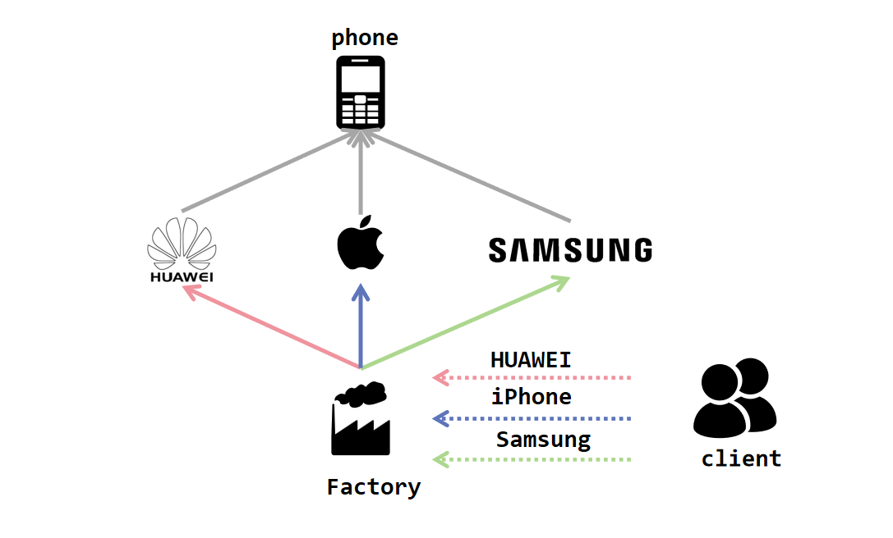
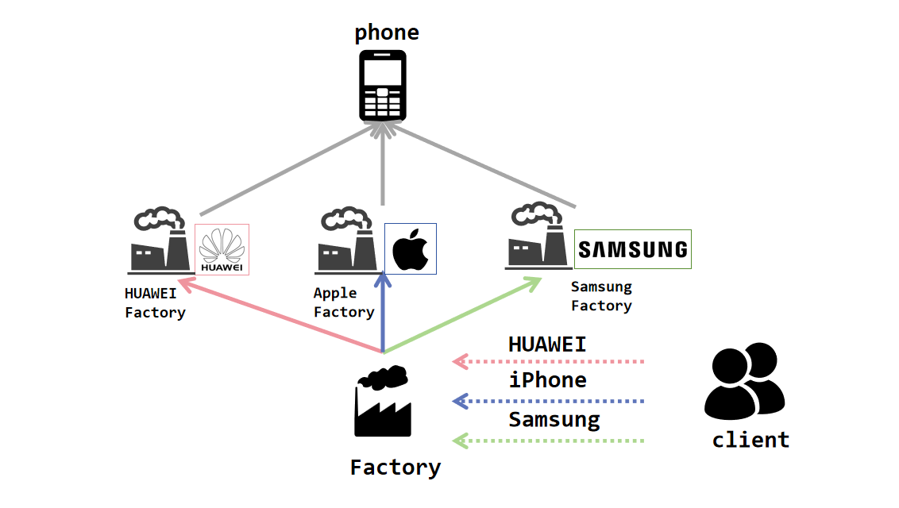
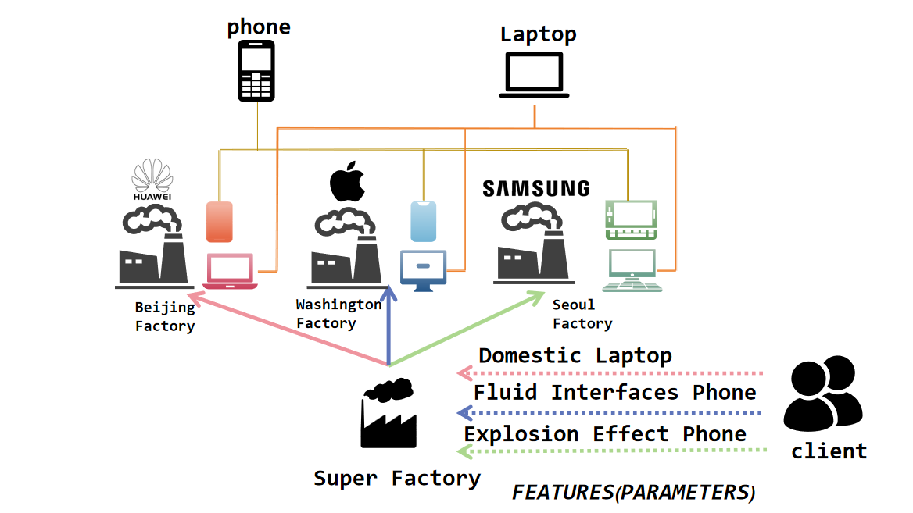
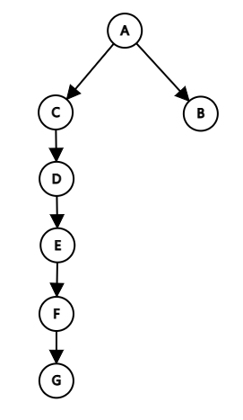
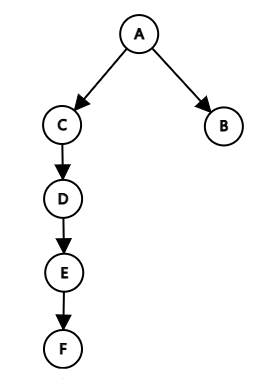
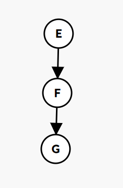

## Part 0. 提交要求 && Junit要求 🤣

请保证提交项目的顶层目录存在两个文件夹：`src`和`test`（命名需严格与此保持一致），请将作业的**功能代码**存放于`src`文件夹下，同时将相关**junit测试类代码**文件存放于`test`文件夹下，以保证评测的正常进行（评测时**只会**针对`src`目录下的文件进行程序**功能**的评测以及代码风格检测，也就是说，`test`目录下的junit测试代码风格不会被检测）。参考目录结构如下：

```plaintext
|-src
  |- Bottle.java
  |- Equipment.java
  |- ...
|-test
  |- BottleTest.java
  |- EquipmentTest.java
  |- ...
```

本次作业，要求Junit测试覆盖率保证method >= 90％，line >= 60%，branch >= 60%。（idea显示的覆盖率和评测测到的覆盖率可能略有差别，请同学们以评测为准。同时请不要使用assert进行断言以免造成不必要的覆盖率损失）

## Part 1. 训练目标 😘

- 掌握和理解设计模式的作用和意义
- 在作业中体验设计模式的理念

## Part 2. 预备知识 😶‍🌫️

在之前的编程任务中，虽然同学们努力地完成了课下作业，但是同学们完成任务的方式或许在系统化、模块化和规范化方面有所欠缺。所以在本次作业中，希望同学们能亲身体验**设计模式**的理念，以更加工程化的方法来完成本次作业和未来的任务。

接下来依次介绍**单例模式**，**工厂模式**和**观察者模式**。

### 一、单例模式

**单例模式**是确保一个类只有一个实例，而且自行实例化并向整个系统提供这个实例。

> 知识回顾-实例 实例指的是通过使用类创建的具体对象。它占用内存并持有对象的数据和方法。实例是真正存在的，可以执行各种操作和访问其属性。

#### 1.如何保证有且仅有一个实例？

该类的构造方法一定是 `private` 的，即不可以被外界进行实例化。且这个实例是属于当前类的静态成员变量。

```java
public class Singleton {
    // 注意static
    private static Singleton singleton;

    // 注意private
    private Singleton(/*parameters*/) {
        /* ... */
    }
}    
```

#### 2.如何向整个系统提供这个实例？

该类应提供一个静态方法，能够向外界/系统提供当前类的实例

```java
public static Singleton getInstance() {
        return singleton;
}
```

#### 3.在什么时机进行该类单例的实例化？

- 饿汉式：在类加载时就进行实例化

```java
public class Singleton {
    private static Singleton singleton = new Singleton(/* paramters */);
}    
```

- 懒汉式：在第一次使用时进行实例化

```java
public class Singleton {
    private static Singleton singleton;

    /* ... */

    public static Singleton getInstance() {
        // 如果是第一次使用：
        if (singleton == null) {
            singleton = new Singleton(/* paramters */);
        }
        return singleton;
    }
}    
```

> 事实上，`getInstance()` 方法还需要注意多线程的同步问题，这部分等我们上OO正课时再进行了解。

### 二、工厂模式

工厂方法模式 (Factory Method Pattern) 又称为工厂模式，也叫虚拟构造器 (Virtual Constructor) 模式或者多态工厂 (Polymorphic Factory) 模式，它属于类创建型模式。

### 简单工厂模式

简单工厂模式 (Simple Factory Pattern):又称为静态工厂方法 (Static Factory Method) 模式，它属于类创建型模式。 在简单工厂模式中，可以根据参数的不同返回不同类的实例。简单工厂模式专门定义了一个类来负责创建其他类的实例，被创建的实例通常都具有共同的父类。 



#### 1. 产品和其共同的父类

这个父类通常都是 **抽象类** ，就像我们在生产一个手机的时候，他不能只是一个手机，他一定是iPhone、Samsung、华为、小米……其中的一种。

> 知识补充-抽象类抽象类可以被理解成一个可以包含普通方法和成员变量的接口，在被子类继承时可以选择性的*Override*抽象类的方法。 深入内容同学们可以课下自行了解。

```java
public abstract class Product {
    private int price;

    public Product(int price) {
        this.price = price;
    }

    public abstract void use();

    public void information() {
        System.out.println(this.price);
    }
}
public class ProductA extends Product{
    public ProductA(int price) {
        super(price);
    }

    @Override
    public void use() {
        System.out.println("AAAA!");
    }
}
public class ProductB extends Product {
    public ProductB(int price) {
        super(price);
    }

    @Override
    public void use() {
        System.out.println("BBBB");
    }
}
```

#### 2.定义工厂来负责创建其他类的实例

```java
public class Factory {
    public static Product create(String type) {
        if (type.equalsIgnoreCase("A")) {
            return new ProductA(100);
        } else if (type.equalsIgnoreCase("B")) {
            return new ProductB(200);
        } else {
            System.out.println("Wrong kind!");
            return null;
        }
    }
}
```

#### 3.生产产品

```java
public class MainClass {
    public static void main(String[] args) {
        Product productA = Factory.create("A");
        Product productB = Factory.create("B");
        Product productC = Factory.create("C");
        /* ... */
    }
}
```

### 工厂模式

工厂模式（Factory Pattern）中，我们定义一个用于创建对象的接口，让子类决定实例化哪个类。工厂方法使一个类的实例化延迟到其子类。 工厂模式和我们之前介绍过的简单工厂模式都属于面向对象设计方法中的创建型模式，它们的目标都是解决对象的创建过程。他们都用于创建对象，将对象的实例化与客户端代码分离。 但二者仍然有不同之处。 首先，二者的抽象程度不同：工厂模式更抽象，它通过定义一个抽象工厂接口和多个**实现工厂子类**来生产不同类型的产品；而简单工厂模式是由一个具体的工厂类负责创建所有的产品对象。 此外，二者在扩展性上也展示出不同特点。当新增一种产品时，工厂模式只需新增一个对应的工厂子类即可，而简单工厂模式在新增产品时需要修改原有的工厂类，这就违反了开闭原则。

> 知识补充-开闭原则(Open-Closed Principle, OCP)是指一个软件实体如类、模块和函数应该对扩展开放, 对修改关闭。通俗解释就是，添加一个新的功能，应该通过在已有代码(模块、类、方法)的基础上进行扩展来实现，而不是修改已有代码。 深入内容同学们可以课下自行了解。

最后，就是工厂被调用的方式不同：工厂模式调用工厂接口来创建具体的产品对象；而简单工厂模式直接调用工厂类的静态方法，并传入一个参数来指定创建的具体产品类型。

通俗来讲，就是简单工厂模式是用一个厂生产多个产品，而工厂模式则是多个厂生产不同的产品。 



#### 1.定义一个用于创建对象的接口

```java
public interface Factory {
    public Product creat(int price);
}
```

#### 2.让子类决定实例化哪个类

```java
public class FactoryA implements Factory{
    @Override
    public Product creat(int price) {
        return new ProductA(price);
    }
}
public class FactoryB implements Factory{
    @Override
    public Product creat(int price) {
        return new ProductB(price);
    }
}
public class MainClass {
    public static void main(String[] args) {
        Factory factoryA = new FactoryA();
        Factory factoryB = new FactoryB();
        factoryA.creat(100).use();
        factoryB.creat(200).use();
    }
}
```

### 抽象工厂模式

抽象工厂模式(Abstract Factory Pattern)：提供一个创建一系列相关或相互依赖对象的接口，而无须指定它们具体的类。抽象工厂模式又称为Kit模式，它是一种对象创建型模式。

如果说工厂模式只能构建同一品类/等级的产品，例如手机（iPhone HUAWEI Samsung…）。那么抽象工厂模式则支持了多种品类，例如手机、笔记本电脑、电视……它打破了工厂和产品一对一的关系，他满足一个具体的工厂类可以生产多个大类的产品



#### 1. 产品类

手机类产品：

```java
public abstract class Phone {
    private int price;

    public Phone(int price) {
        this.price = price;
    }

    public abstract void use();
}
public class iPhone extends Phone{
    public iPhone(int price) {
        super(price);
    }

    @Override
    public void use() {
        System.out.println("APPLE iPhone!!!");
    }
}
public class Honor extends Phone{
    public Honor(int price) {
        super(price);
    }

    @Override
    public void use() {
        System.out.println("HUAWEI Honor!!!");
    }
}
```

------

笔记本电脑类产品：

```java
public abstract class Laptop {
    private int size;

    public Laptop(int size) {
        this.size = size;
    }

    public abstract void use();
}
public class iMac extends Laptop{
    public iMac(int size) {
        super(size);
    }

    @Override
    public void use() {
        System.out.println("APPLE iMac!!");
    }
}
public class MateBook extends Laptop{
    public MateBook(int size) {
        super(size);
    }

    @Override
    public void use() {
        System.out.println("HUAWEI MateBook!!");
    }
}
```

#### 2. 工厂类

```java
public interface Factory {
    public Phone creatPhone(int price);
    public Laptop creatLaptop(int size);
}
public class BJFactory implements Factory {
    @Override
    public Phone creatPhone(int price) {
        return new Honor(price);
    }

    @Override
    public Laptop creatLaptop(int size) {
        return new MateBook(size);
    }
}
public class LAFactory implements Factory {
    @Override
    public Phone creatPhone(int price) {
        return new iPhone(price);
    }

    @Override
    public Laptop creatLaptop(int size) {
        return new iMac(size);
    }
}
```

#### 3. 客户端调取

```java
public class MainClass {
    public static void main(String[] args) {
        Factory Beijing = new BJFactory();
        Factory LosAngeles = new LAFactory();
        Beijing.creatPhone(8000).use();
        LosAngeles.creatPhone(11000).use();
        Beijing.creatLaptop(15).use();
        LosAngeles.creatLaptop(13).use();
    }
}
```

输出

```txt
HUAWEI Honor!!!
APPLE iPhone!!!
HUAWEI MateBook!!
APPLE iMac!!
```

### 三、观察者模式

观察者模式（Observer Pattern）是一种行为型设计模式，它定义了一种一对多的依赖关系，当一个对象的状态发生改变时，其所有依赖者都会收到通知并自动更新。

### 观察者模式解析

观察者--多 被观察者--1 我们举一个例子，同学们经常在B站看up主们发的视频，当关注的up主更新视频时，会收到他的更新通知。

#### 1.创建up主和用户接口

```java
public interface Uploader {
    public void addFollower(User follower); // 增加关注
    public void notifyFollowers(); // 通知所有关注用户
}
public interface User {
    public void watch();
}
```

#### 2.实现up主和用户接口

```java
import java.util.ArrayList;

public class Up implements Uploader {
    // 管理观众们
    public ArrayList<User> followers = new ArrayList<>();
    // 更新状态 TRUE - 更新了 :) FALSE - 没更新 :(
    public boolean updatingStatus;

    @Override
    public void addFollower(User follower) {
        followers.add(follower);
    }

    @Override
    public void notifyFollowers() {
        followers.forEach(follower -> follower.watch(this));
        /* <==>
        for (User follower : followers) {
            follower.watch(this);
        }
        */
    }
}
public class Follower implements User{
    private String name;

    public Follower(String name) {
        this.name = name;
    }

    @Override
    public void watch(Up up) {
        System.out.println(name + " is watching " + up.name + "'s channel");
    }
}
```

#### 3.被观察者状态改变 → 通知观察者！

```java
public class MainClass {
    public static void main(String[] args) {
        Uploader classmateHe = new Up("何同学");
        classmateHe.addFollower(new Follower("AAA"));
        classmateHe.addFollower(new Follower("BBB"));

        // 何同学更新了！
        classmateHe.notifyFollowers();
    }
}
```
``` java
AAA is watching 何同学's channel
BBB is watching 何同学's channel
```

## Part 3. 题目描述 😁

### 背景

本次作业将是面向对象先导课程的最后一次迭代开发。核心要点包括但不限于：

- 雇佣与援助系统实现：实现雇佣关系建立、记录体力状态、援助逻辑实现、雇佣关系解除
- 递归攻击战斗实现：定义递归攻击逻辑、设置递归深度限制、战斗类型处理
- 秘境工厂探险副本设计：战斗力对比机制、顺序挑战逻辑、宝物加成系统

### 雇佣与援助

在本次作业中，冒险者间可相互雇佣，并设有“援助”机制，但此功能仅在（第五次作业引入的**普通**战斗中生效）。

假设一次战斗的被攻击者序列为 *defender1*,*defender2*,…,*defenderk*。被冒险者雇佣的冒险者们需要密切关注雇主的体力状态。具体规则如下：

1. **战斗前准备**：对于每个 *defenderi*，被 *defenderi* 雇佣的冒险者们会记录 *defenderi* 当前的体力。

2. **战斗后处理**：若战斗失败，则不发生任何变化。若战斗**成功**，则遵循以下流程：

   - 首先，所有受攻击者体力根据第五次作业的规定发生相应变化。

   - 其次，攻击者装备耐久减一，若耐久归零则装备被销毁。

   - 接着，若受攻击者 *defenderi* 的体力<=`站前体力值 / 2`，其雇佣的冒险者将尝试给予 *defenderi* **自己**携带的所有装备（若被雇佣的冒险者未携带装备，则不进行任何操作），即被雇佣的冒险者不再携带、不再拥有这些装备，而 *defenderi* 拥有但并未携带这些装备。无论是否成功给予装备，每位参与援助的冒险者都会增加一次对 *defenderi* 的援助次数记录。

   - 进行援助后，冒险者会评定自己援助 *defenderi* 的次数。若此时被 *defenderi* 雇佣的冒险者 A 援助 *defenderi* 的次数**严格大于 3**，则冒险者 A 将自行解开与 *defenderi* 的雇佣关系，即 A 不再被视为被 *defenderi* 雇佣的冒险者。

     **注意**：此后若 A 再次被 *defenderi* 雇佣，那么援助 *defenderi* 的次数**重新从零开始计算**。

3. **援助顺序**：严格遵循输入的被攻击者顺序进行。例如，若`adv_3`同时受雇于`adv_1`和`adv_2`，且两者均需援助，则：

   - `adv_3`先援助输入顺序靠前的`adv_1`：尝试将所有自己携带的装备给予 `adv_1`，援助 `adv_1` 次数 +1
   - 再援助`adv_2`：尝试将所有自己携带的装备给予 `adv_2`，但此时 `adv_3` 没有携带装备，所以无事发生。援助 `adv_2` 次数 +1

4. **雇佣关系明确性**：有且仅有通过 11 号指令才能建立雇佣关系，也即，若 A 雇佣 B，B 雇佣 C，而 A 未在 11 号指令中雇佣 C，则 C 不被视为被 A 雇佣的冒险者，C 也不用在 A 退出战斗的时候给 A 装备。

### 递归攻击

本次作业新增战斗类型，即连环递归攻击模式。再次强调，援助功能在该场景中**无效**，不造成任何影响。

**在战斗成功的基础上**（规则详见第五次作业，值得强调的是：受攻击方的整体防御能力是**递归后所有潜在受攻击者**防御力中的最大值），递归攻击简化为两个核心步骤：

1. **识别潜在受攻击者**：形成受攻击者集合。
2. **遍历集合**：确保每位冒险者仅受一次攻击。

关于如何识别潜在受攻击者，规则简述如下：

当冒险者发起连环递归攻击时，其目标可能包括多位冒险者，递归深度限制为 5。

初始受攻击者集合设为 *A*1,*B*1,*C*1,…。对于集合中任一冒险者（如 *A*1），该冒险者及其雇佣的所有冒险者（如 *A*2，*A*2再雇佣的等）均被视为潜在受攻击者，并递归地加入集合。此过程持续进行，当递归到第5层（即到达 *A*5时），将 *A*5 加入集合，但不会再递归考虑 *A*5 雇佣的冒险者，至此完成以 *A*1为起点的攻击序列分支。

重要的是，此过程按初始受攻击者集合中冒险者的输入顺序逐一进行，确保所有指定目标均被全面且深入地覆盖。

> 示例-Example
>
> 若游戏中有七位冒险者：**A**、**B**、**C**、**D**、**E**、**F** 和 **G**，他们之间的雇佣关系如下：
>
> - **A** 雇佣了 **B** 和 **C**。
> - **C** 依次雇佣了 **D**、**D** 雇佣了 **E**、**E** 雇佣了 **F**、**F** 雇佣了 **G**。
> - **B** 没有雇佣任何冒险者。
>
> 雇佣关系图如下：
>
> 
>
> 现在，我们要对 **{A, E}** 发起连环递归攻击。
>
> **步骤1：识别潜在受攻击者**
>
> 1. 初始状态：受攻击者集合为{A,E}。
>
> 2. 处理A：
>
>    - **A** 被加入潜在受攻击者集合。
>
>    - **A** 雇佣了 **B** 和 **C**，因此 **B** 和 **C** 被加入集合。
>
>    - **C** 雇佣了 **D**，所以 **D** 被加入集合。接着，**D** 雇佣了 **E**，**E** 雇佣了 **F**，所有这些冒险者都被加入集合。递归至 **F**，即达到递归深度限制后，停止进一步递归。
>
>    - 处理完 **A** 后，潜在受攻击者集合为 **{A, B, C, D, E, F}**。以**A**为起点的攻击序列分支图示如下：
>
>      
>
> 3. 处理E：
>
>    - **E** 被加入潜在受攻击者集合。
>
>    - **E** 雇佣了 **F**，**F** 被加入集合。
>
>    - **F** 雇佣了 **G**，**G** 被加入集合。以**E**为起点的攻击序列分支图示如下：
>
>      
>
> 最终，潜在受攻击者集合为 **{A, B, C, D, E, F, G}**。
>
> **步骤2：遍历集合**
>
> 在遍历潜在受攻击者集合时，确保每位冒险者仅受一次攻击。最终，**A**、**B**、**C**、**D**、**E**、**F** 和 **G** 每人仅受一次攻击，完成连环递归攻击。

#### 战斗类型总结

| 战斗类型`attack_type` | 意义                                                         |
| --------------------- | ------------------------------------------------------------ |
| `normal`              | 普通战斗，援助功能仅在此场景下生效。其余战斗规则详见第五次作业，此处不做赘述 |
| `chain`               | 递归攻击战斗。注意：需要在计算受攻击方的整体防御能力后，才能判定战斗是否成功（详情参照第五次作业规定） |

### **秘境工厂探险：终极冒险指南**

**欢迎语**： 在冒险者王国辉煌旅程的尾声，我们隆重推出“秘境工厂探险”副本——一场交织着奇幻与挑战的终极盛宴。诚邀您，英勇的探险家，步入这片被遗忘的荒芜之地，揭开古老废弃工厂的神秘面纱，追寻那世代守护的绝世宝藏。

**探险背景**： 在这片被时光尘封的领域，一座古老而神秘的废弃工厂隐匿其间，其内藏有无数探险者梦寐以求的稀世珍宝。然而，通往荣耀的道路布满荆棘，一群凶悍的守卫怪物筑起了铜墙铁壁，誓死捍卫宝藏的秘密，成为每位勇者前行路上的严峻考验。

#### 战斗逻辑与策略

**核心机制**：

- **战斗力对比**：具体而言，**击败守门怪物的唯一条件为：战斗方的综合战力（战斗方自身、所携带的全部物品，以及雇佣的所有冒险者的战斗力总和）必须严格大于目标守门怪物的战斗力**，请注意战斗力和综合战力的区别。一旦达成此条件，战斗即宣告胜利，而相应的宝藏也将作为荣耀的象征，赠予胜利的勇者。
- **顺序挑战**：探险者需按守门怪物**战斗力由低到高**的顺序逐一挑战，每击败一怪，即解锁通往更深层宝藏的路径。同时，探险者及其雇佣的所有冒险者都获得**即时生效**的宝物加成。

| 守门怪物`Guard` | 战斗力`CE` | 宝物信息`Treasure Info` | 宝物功效          |
| --------------- | ---------- | ----------------------- | ----------------- |
| `Shd`（暗影）   | 1000       | `Cloak of Shadows`      | 每人增加防御力 40 |
| `Flm`（烈焰）   | 2000       | `Flamebrand Sword`      | 每人增加攻击力 40 |
| `Stn`（石卫）   | 3000       | `Stoneheart Amulet`     | 每人增加防御力 40 |
| `Wnd`（风灵）   | 4000       | `Windrunner Boots`      | 每人增加防御力 30 |
| `Frz`（冰霜）   | 5000       | `Frostbite Staff`       | 每人增加攻击力 50 |

#### 伪代码与类设计概览

为了助力各位英勇的探险家，我们特此发布详尽攻略，旨在精准指导每一位冒险者如何智取守门怪物，将梦寐以求的宝物收入囊中。以守门怪物 `Shd` 为例，我们给出了设计参考。

```java
// 守门怪物接口  
interface Guard {
    boolean fight(Adventurer adv); // 守门怪物与冒险者战斗，返回战斗结果 
    String getType(); // 返回守门怪物的类型  
}

// 具体的守门怪物类（以Shd为例）  
class Shd implements Guard {
    @Override
    public boolean fight(Adventurer adv) {
        return adv.getComprehensiveCE() > 1000;
    }

    @Override
    public String getType() {
        return "Shd";
    }
}

// 宝物接口  
interface Treasure {
    void showInfo(); // 显示宝物信息的方法  
    void useBy(Adventurer adv); // 让该冒险者获得这个宝物的加成
}

// 具体的宝物类（以Shd对应的宝物为例）  
class ShdTreasure implements Treasure {
    @Override
    public void showInfo() {
        System.out.println("Cloak of Shadows");
    }

    @Override
    public void useBy(Adventurer adv) {
        // TODO : 实现你的逻辑
    }
}

// 宝物工厂  
class TreasureFactory {
    public static Treasure createTreasure(Guard guard) {
        switch (guard.getType()) {
            case "Shd":
                return new ShdTreasure();
            // ... 为其他守门怪物添加更多的case  
            default:
                throw new IllegalArgumentException("Unknown guard type");
        }
    }
}

// 代码示例  
public class AdventureGame {
    public static void main(String[] args) {
        Adventurer adv = ...;
        Guard shd = new Shd();
        if (shd.fight(adv)) {
            Treasure treasure = TreasureFactory.createTreasure(shd);
            treasure.showInfo(); // 显示获得的宝物信息
            treasure.useBy(adv);
        }
    }
}
```

### 操作要求

在本次作业中，初始时，你没有需要管理的冒险者，我们通过若干条操作指令来修改当前的状态：

（**新增指令 11-12，指令 10 的输入格式有变，其余指令若无特殊说明，则要求和限制同上一次迭代作业**）

1. 加入一个需要管理的冒险者（新加入的冒险者不拥有任何药水瓶、装备和碎片，并且初始体力为 500，初始攻击力为 1，初始防御力为 0）
2. 给某个冒险者增加一个药水瓶
3. 给某个冒险者增加一个装备
4. 给某个冒险者的某个装备提升一点耐久度
5. 删除某个冒险者的某个物品
6. 冒险者尝试携带他拥有的某个物品
7. 冒险者使用某个药水瓶
8. 冒险者获得一个碎片
9. 冒险者尝试兑换一次福利
10. 冒险者尝试进行一次战斗
11. 冒险者雇佣另一位雇佣者
12. 冒险者进入”秘境工厂探险“副本

### 输入输出格式

第一行一个整数 n，表示操作的个数。

接下来的 n 行，每行一个形如 `{type} {attribute}` 的操作，`{type}` 和 `{attribute}` 间、若干个 `{attribute}` 间使用**若干**个空格分割，操作输入形式及其含义如下

| type | attribute                                                    | 意义                                                         | 输出（每条对应占一行）                                       |
| ---- | ------------------------------------------------------------ | ------------------------------------------------------------ | ------------------------------------------------------------ |
| 1    | `{adv_id} {name}`                                            | 加入一个 ID 为 `{adv_id}`、名字为 `{name}` 的冒险者          | 无                                                           |
| 2    | `{adv_id} {bot_id} {name} {capacity} {type} {CE}`            | 给 ID 为 `{adv_id}` 的冒险者增加一个药水瓶，药水瓶的 ID、名字、容量、类型、战斗力分别为 `{bot_id}`、`{name}`、`{capacity}、{type}、{CE}`。特别地，当type为 `HpBottle` 时，我们保证输入的`CE`为 00 | 无                                                           |
| 3    | `{adv_id} {equ_id} {name} {durability} {type} {CE}`          | 给 ID 为 `{adv_id}` 的冒险者增加一个装备，装备的 ID、名字、耐久度、类型、战斗力分别为 `{equ_id}`、`{name}`、`{durability}、{type}、{CE}` | 无                                                           |
| 4    | `{adv_id} {equ_id}`                                          | 将 ID 为 `{adv_id}` 的冒险者的 id 为 `{equ_id}` 的装备提升一点耐久度 | `{一个字符串} {一个整数}`，字符串为装备的 name，整数为装备提升耐久后的耐久度 |
| 5    | `{adv_id} {id}`                                              | 将 ID 为`{adv_id}`的冒险者的 id 为 `{id}` 的物品删除         | `{一个字符串A} {一个字符串B} {一个整数C}`，字符串 A 为物品的类名（答案只能在以下类名中挑选其一： `HpBottle`、`AtkBottle`、`DefBottle`、`Axe`、`Sword`、`Blade`），字符串 B 为被删除的物品的name 若物品为**药水瓶**：整数 C 为被删除的药水瓶的容量 若物品为**装备**：整数 C 为被删除的装备的耐久度 |
| 6    | `{adv_id} {id}`                                              | ID 为 `{adv_id}` 的冒险者尝试携带 id 为 `{id}` 的物品        | 无                                                           |
| 7    | `{adv_id} {bot_id}`                                          | ID 为 `{adv_id}` 的冒险者尝试使用他拥有的 id 为`{bot_id}`的药水瓶 | 成功：`{一个字符串} {一个整数A} {一个整数B} {一个整数C}`，字符串为该冒险者的 `name`，整数 A 为该冒险者使用该药水瓶后的体力值，整数 B 为该冒险者使用该药水瓶后的攻击力值，整数 C 为该冒险者使用该药水瓶后的防御力值 失败： `{adv_name} fail to use {name}`，`adv_name` 为 ID 为 `adv_id` 的冒险者的 name， `name` 为 ID 为 `bot_id`的药水瓶的 name) |
| 8    | `{adv_id} {frag_id} {name}`                                  | ID 为`{adv_id}`的冒险者获得一个 id 、名字分别为`{frag_id}`、`{name}`的碎片 | 无                                                           |
| 9    | `{adv_id} {name} {welfare_id}`                               | ID 为`{adv_id}`的冒险者尝试使用其拥有的名字为`name`的碎片兑换一次福利，福利标识码为`welfare_id` | **成功**：**a)** `{一个字符串} {一个整数}`，字符串为对应药水瓶的name，整数为对应药水瓶的容量 **b)** `{一个字符串} {一个整数}`，字符串为对应装备的name，整数为对应装备的新耐久度 **c)** `Congratulations! HpBottle {name} acquired` ，name为获得的药水瓶的name **失败**：`{一个整数}: Not enough fragments collected yet` ， 整数为该冒险者拥有的名字为`frag_name`的碎片的数目 |
| 10   | `{adv_id}  {name} {attack_type} {k}` `{adv_id_1}` `{adv_id_2}` … `{adv_id_k}` | ID 为 `{adv_id}` 的冒险者尝试使用名字为 `{name}`的装备与`k`个冒险者进行一次战斗类型为`{attack_type}`的战斗（k个冒险者的 ID 分别为 `adv_id_1`、`adv_id_2`、…、`adv_id_k`） | **`normal`成功**：输出`k`行，第`m`行的格式为`{ID 为 adv_id_m的冒险者的name} {ID 为 adv_id_m的冒险者受到攻击后的体力值}`  `chain`成功：`{一个整数}`，整数为本次战斗中所有冒险者失去的体力值的总和 **战斗失败**：`Adventurer {adv_id} defeated`，其中`{adv_id}`为输入中的攻击者的 ID |
| 11   | `{adv_id_1} {adv_id_2}`                                      | ID 为 `{adv_id_1}`的冒险者雇佣 ID 为 `{adv_id_2}`的冒险者    | 无                                                           |
| 12   | `{adv_id}`                                                   | ID 为 `{adv_id}`的冒险者挑战”秘境探险工厂“副本               | 按宝物获得的顺序从早到晚输出 `k` 行，每行为`{一个字符串}`，字符串为宝物信息。如果冒险者在这次副本探险内没有获得宝物，则不输出。 |

### 样例

#### 输入

```
9
1 988244353 adv1
2 988244353 1 bottle 50 AtkBottle 1000
3 988244353 2 equipment 50 Axe 2000
6 988244353 1
6 988244353 2
1 1000000007 adv2
11 988244353 1000000007
12 988244353
7 988244353 1
```

#### 输出

```
Cloak of Shadows
Flamebrand Sword
Stoneheart Amulet
adv1 500 1041 80
```

### 数据限制

#### 变量约束

| 变量         | 类型   | 说明                                   |
| ------------ | ------ | -------------------------------------- |
| `id`         | 整数   | 取值范围：0 - 2147483647               |
| `name`       | 字符串 | 保证不会出现空白字符，长度区间: (0,40) |
| `capacity`   | 整数   | 取值范围：0 - 2147483647               |
| `durability` | 整数   | 取值范围：1 - 2147483647               |
| `HitPoint`   | 整数   | 取值范围：1 - 2147483647               |
| `CE`         | 整数   | 取值范围：0 - 2147483647               |
| `atk`        | 整数   | 取值范围：1 - 1073741823               |
| `def`        | 整数   | 取值范围：0 - 1073741823               |

注意，变量约束指的是，在程序运行时，输入和对应属性值均保证在表格中给出的范围内。

#### 操作约束

1. **保证所有的冒险者、药水瓶、装备 id 均不相同。而碎片之间的 id 可以相同，被删除或被销毁的物品的 id 不可能成为碎片的 id**
2. 保证删除了的药水瓶/装备的 id 不会再次出现，保证因耐久度降为0而被销毁的装备的 id 不会再次出现
3. 操作 2-12 保证所有冒险者均已存在
4. 操作 4-7/10 保证该冒险者拥有操作中提到 id 的药水瓶或装备
5. 操作 9 保证该冒险者拥有至少一个操作中提到`name`的碎片。且保证所分配的`welfare_id`将确保为该冒险者当前已持有的物品ID之一，或是一个全新且此前从未出现过的ID
6. 保证增加的装备、药水瓶原本不存在
7. 操作数满足 1≤n≤10000
8. 战斗中被攻击的人数满足1≤k≤10
9. 操作 2 保证：当 type 为 `HpBottle` 时，输入的 CE 一定为 0
10. 操作 7/10 **不**保证：提到的药水瓶或装备已被携带
11. 保证战斗结束后，所有相关冒险者的体力值均保持在大于 0 的安全范围内
12. 操作 11 保证 ID 为 `{adv_id_2}` 的冒险者未被 `{adv_id_1}` 的冒险者雇佣，保证不会出现两个或多个冒险者之间循环雇佣的情况
13. 对于每个冒险者，保证所雇佣的冒险者不超过 10 个
14. 保证递归攻击战斗最多出现 50 次
15. 保证操作 12 最多出现 50 次

### 提示

考虑到正课尚未讲解有关输入解析的内容，我们在此提供一份输入解析代码，同学们可以将其复制到自己代码中的适当位置直接使用，当然，同学们也可以自行设计代码来进行输入解析。

```java
ArrayList<ArrayList<String>> inputInfo = new ArrayList<>(); // 解析后的输入将会存进该容器中, 类似于c语言的二维数组
Scanner scanner = new Scanner(System.in);
int n = Integer.parseInt(scanner.nextLine().trim()); // 读取行数
for (int i = 0; i < n; ++i) {
   String nextLine = scanner.nextLine(); // 读取本行指令
   String[] strings = nextLine.trim().split(" +"); // 按空格对行进行分割
   inputInfo.add(new ArrayList<>(Arrays.asList(strings))); // 将指令分割后的各个部分存进容器中
}
```

经过这段代码，输入的信息会被存入 `inputInfo` 这个"二维数组"中，遍历该容器即可取出各行指令及其各个部分。

## 总结 💕❤️😍

### 重构 😏😏

在开始做这次的作业之前，我先对以前的作业进行了一次重构，加入了设计模式的思想！🥰

#### 工厂模式的创建 🥳

创建了`BottleFactory`和`EquipmentFactory`两个工厂接口，然后通过实现接口，创建了 `AtkBottleFactory` `DefBottleFactory` `HpBottleFactory` `AxeFactory` `BladeFactory` `SwordFactory` 这几个工厂类 😣

这样优化了`Bottle`和`Equipment`的各种子类型的实例化，实现了封装的思想 😎😎😎

同时，对于*秘境工厂探险副本*，我们同样可以类似地去创建宝物工厂

#### 软件包的创建 🫡

在之前的几次作业当中，我们都是把所有的类和接口放在 `src` 一个文件夹里面的，在这次的重构里，我创建了几个软件包来进行分类管理，使得相同特征的类在**一个软件包**里面，这样对检查代码debug也有好处。

不过，需要注意的是，为了统一性，建议在创建软件包之后把所有的可见性改为 `public` 否则可能出现找不到类的情况！😵‍💫

### 迭代 😋😋

#### 观察者模式的创建 😣

对于每个冒险者`Adventure`类，为了实现雇佣的功能，需要让被雇佣的冒险者去监听雇佣者的体力变化情况，这样的一个功能就是典型的观察者模式！

在这里，我创建了观察者接口 `Watcher` 和被观察者接口 `Observed` 

```java
package adventurer;

public interface Observed {
    public void registerObserver(Watcher o);

    public void notifyObservers();
}
```

```java
package adventurer;

public interface Watcher {
    public void watch(Observed o);
}
```

然后，让 `Adventure` 去实现这两个接口就可以啦！😌😌😌

#### 秘境工厂探险 👿

这里的副本就可以再单独隔离出一个软件包`uncharted`，然后按照指导书上面的建议去分别构造就可以了，不算很难

#### 注意点 😪🥱

- 这次设计 `HashMap` 的遍历更改是很多的，有了上次的经验，我**全部都使用了迭代器来进行操作**，这次强测总不会给我报错了吧~~~，再报错我真的会疯掉的🤡
- 对于查找潜在被攻击者的递归操作时，要注意**递归的层数不能大于5**，我最开始就没有注意到 😟

```java
HashSet<Adventure> totalAttacks = new HashSet<>();
for (Adventure adventure : attacks) {
    int currentDepth = 1;
    totalAttacks.add(adventure);
    adventure.findAttacks(totalAttacks, currentDepth);
}    

	public void findAttacks(HashSet<Adventure> totalAttacks, int currentDepth) {
        if (currentDepth < 5) {			// 是小于5，不是小于等于
            watchers.keySet().forEach(key -> {
                totalAttacks.add((Adventure) key);
                ((Adventure) key).findAttacks(totalAttacks, currentDepth + 1);
            });
        }
    }
```

### 类图 😚😚

在这里给出我的类图！！！还是非常的有成就感的 🥰


### 10.24更新 🤡🤡

完蛋了，第六次作业的强测也寄掉了，总结了一下，主要是一个原因

> 指导书中的`normal`战斗类型的成功战斗后的执行顺序应该是：
>
> 战斗扣血->**装备耐久度减一**->雇佣者援助->雇佣者判断是否持续雇佣关系

我在最初的代码中忽略了这个点，我是在最后才进行装备耐久度减一的操作，对于以下这种特殊情况，是不符合要求的！😪

> （讨论区给出的特殊情况）🫡🫡🫡
>
> 因为存在被雇佣者攻击雇佣者的情况，假若被雇佣者攻击的装备碰巧快报废了（耐久度为1），那么
>
> 被攻击的雇佣者扣血后，装备会报废，而被雇佣者可以**在对雇佣者造成伤害的同时不用给老板任何实体援助就获得援助次数**

#### 思考

- 根据这几次作业的产生的一点小思考，我发现在构造 `Bottle` 以及 `Equipment` 的时候，不应该传入各种参数之后才 new 一个对象，而应该在外面 new 完一个对象之后再传入它的引用！🥳🥳🥳🥳🥳
- 同时，由于有些方法过长，我使用了Java8特性中的流 `Stream` API 来**简化代码**
 ``` Java
 int maxDef1 = 0;
 for (Adventure adventure : attacks) {
     if (adventure.getDef() > maxDef1) {
         maxDef1 = adventure.getDef();
     }
 }
 ```

可以更改为

```Java
int maxDef1 = attacks.stream().mapToInt(Adventure::getDef).max().orElse(0);
```

举一反三，你还可以对这个进行转换

```Java
ArrayList<Integer> attacksHitPoint = new ArrayList<>();
for (Adventure adventure : attacks) {
    attacksHitPoint.add(adventure.getHitPoint());
}
```

```Java
List<Integer> attacksHitPoint = attacks.stream()
                                       .map(Adventure::getHitPoint)
                                       .collect(Collectors.toList());

```

