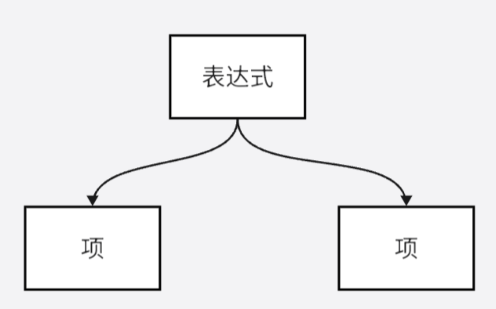

## Part 0. 提交要求 🤣

本作业提供了代码框架，同学们需要补全这份代码，理解表达式递归解析的具体代码实现。

**代码中需要补全的部分已经用 `TODO` 标出，请根据题意完善代码，并提交到个人仓库中以完成本次作业**

**本次作业仅允许补充标出 `TODO` 的部分，不允许更改其他部分代码（checkstyle导致的必要修改除外），否则将会被视为无效作业**

**官方包解读：**

```plaintext
| - Expr.java
| - Factor.java
| - Lexer.java
| - MainClass.java // 程序入口
| - Num.java
| - Parser.java
| - SubExpr.java
| - SubTerm.java
| - Term.java
| - Token.java
| - Var.java
```

## Part 1. 训练目标 😘

- 通过代码实例了解结构化表达式
- 学习递归下降解析方法，初步体会层次化设计的思想的应用和工程实现

## Part 2. 预备知识 😶‍🌫️

在即将开启的2025年春季学期里，同学们将正式步入oo课程的学习阶段。为了构建更为稳固的知识基础，本次作业深入介绍递归下降法的相关理论框架与实现细节，辅助同学们深入理解并掌握该方法的精髓，以期在后续的OO课程学习中，同学们能够游刃有余，顺利达成学习目标。

### 文法

文法（Grammar），作为对语言结构的精准定义与全面描述，其核心在于通过形式化的规则体系来规约语言的构造法则。简而言之，文法即是语言的框架与规范。

值得注意的是，文法这一概念所涵盖的领域相当广泛，它深入语言的多个层面。然而，在此特定语境下，本次讨论将聚焦于其重要组成部分——词法与语法。词法关注于词汇的构成规则，即如何界定与分类语言中的基本单位（如单词、符号等）；而语法则进一步探讨这些基本单位如何按照一定的结构与顺序组合成意义明确的句子或表达式。通过对这两者的深入剖析，同学们得以更精确地把握语言的内在逻辑与表达方式。

#### 词法

词法（Lex），是指语言中的词汇及其属性和含义的规则。它规定了一个语言中的"词"是如何构成的。

具体而言，以“变量名”这一语法单元为例，其定义明确为：由至少一个（即大于0个）小写字母组成的字符串。此定义可形式化为：

<var_name>→<letter>∣<letter><var_name>

<letter>→′a′∣′b′∣⋯∣′z′

在此表示法中：

1. 尖括号`< >`内所包含的内容，明确标识了一个语法成分的边界。
2. 右箭头`→`则直观展示了构成关系，即左侧部分由右侧部分的具体规则组合而成。
3. 竖线`|`作为选择符，表明在特定情况下，规则可以从其两侧提供的任一选项中选取，体现了规则的灵活性与多样性。

遵循上述规则，变量名的构成标准被清晰地界定。换言之，合法的变量名必须严格符合一个或多个小写字母的序列模式，且不允许出现如非字母字符（如下划线）的插入。因此，`buaa`符合这一定义，被视为有效的变量名；而`buaa_cs`因包含非字母字符（下划线），则不符合上述对变量名的定义标准。

#### 语法

语法（Syntax），是指描述语言中句子结构和组织方式的规则。它规定了一个语言中的"句"是如何构成的。

例如下面的例子：

<句子>→<主语><谓语>

<主语>→"i"∣"you"

<谓语>→"smile"∣"laugh"

由此规则可知，句子是由主语与谓语两个基本部分通过特定方式连接而成的复合结构。其中主语可能是`i`，也可能是`you`，而谓语可能是`smile`，可能是`laugh`。

### 词法&语法分析

在深入探讨了上述概念之后，自然而然地，同学们面临一个核心问题：

面对一个给定的字符串时，应当如何准确判断它是否符合之前所定义的变量名规范？进一步地，又该如何判定该字符串是否满足所描述的句子结构？

#### 词法分析 LEXER

首先，从一个简单而基础的应用场景出发：

给定一个字符串，目标是判断其是否符合先前定义的变量名规范。这一过程首先涉及检查字符串的长度，确保它不为0，随后对字符串中的每一个字符进行逐一验证，确认它们是否全为字母。这一步骤是词法分析在识别特定词汇类型（如变量名）时的基本实践。

接下来，探讨一个更为复杂的问题场景：

设想存在多种词类A、B、C、D，每种词类均伴随着其独特的构成规则。 在此前提下，做出合理假设，即这些规则之间既无矛盾也无重复，确保了词法分析的准确性和一致性。

现在，给定一个字符串，该字符串完全由上述定义的词类A、B、C、D中的词汇构成。而任务是：不仅识别出字符串中包含的所有词汇，还需明确标注每个词汇所属的词类。

这个问题不仅考验了对于字符串内容的判断能力，更要求同学们掌握高效的字符串划分技巧。为了更直观地说明这一点，接下来借鉴之前提及的语法示例进行说明：

ismileyoulaughsmile

观察这个字符串中的单词，可以发现它们各自拥有独特的开头字母：'i'（代表'i'）、'y'（代表'you'）、's'（代表'smile'）、'l'（代表'laugh'）。这些开头的唯一性构成了一个重要的识别线索。**由于这些开头字母在词类定义中是不重复的**，因此当词法分析程序读取到字母'l'时，它能够立即确定接下来的词汇是'laugh'。

基于这一观察，策略可以设计如下：程序通过依次读取字符串中的每一个字母，并依据当前字母与已知词类开头字母的对应关系，来逐步构建并识别出完整的词汇及其所属词类。这种方法不仅逻辑清晰，而且在实际应用中具有高度的可操作性和准确性。

```java
for (int i = 0; i < str.size(); i++) {
    if (str.charAt(i) == 'i') {
        System.out.println("i - 主语");
    } else if (str.charAt(i) == 'y') {
        i = i + 2;
        System.out.println("you - 主语");
    } else if (str.charAt(i) == 's') {
        i = i + 4;
        System.out.println("smile - 谓语");
    } else {
        i = i + 4;
        System.out.println("laugh - 谓语");
    }
}
```

##### Token

阅读前文之后你可能会想，是否应考虑将分析所得的信息进行存储，以便于后续的高效利用呢？

**token**作为文本的最小语法单位，常被用于表示和处理文本数据。在此场景下，token可作为存储字符串经词法分析后所得单元的适宜载体。

为此，建议采用**列表（list）**作为token的存储结构。每当一个token被识别，即将其添加至列表中。通过一次完整的扫描，原字符串的信息即可被有效地整合并转化为一个token列表，为后续操作提供便利。

```java
for (int i = 0; i < str.size(); i++) {
    if (str.charAt(i) == 'i') {
        tokenList.add(new Token("i", "主语"));
    } else if (str.charAt(i) == 'y') {
        i = i + 2;
        tokenList.add(new Token("you", "主语"));
    } else if (str.charAt(i) == 's') {
        i = i + 4;
        tokenList.add(new Token("smile", "谓语"));
    } else {
        i = i + 4;
        tokenList.add(new Token("laugh", "谓语"));
    }
}
```

#### 语法分析 PARSER

目前，输入的字符串已经成功细化为一系列独立的token，标志着处理流程迈入了一个新的阶段。自此刻起，语法分析的任务将聚焦于这个精心构建的“token”列表之上，而非原始的字符串数据。

从代码设计的视角审视，这一转变——即将字符串通过词法分析转化为token列表，再作为半成品传递给后续的语法分析阶段——体现了高度的模块化思想。它巧妙地避免了语法分析直接介入词法解析的复杂过程，从而显著降低了这两个不同处理层级之间的耦合度。这种设计不仅提升了代码的可维护性，也为未来的扩展与优化预留了空间。

为了深入阐述语法分析的具体实施策略，接下来将引入一个更为复杂的语法规则作为示例：

<表达式>→<项>∣<项>′+′<表达式>

<项>→<因子>∣<因子>′∗′<项>

<因子>→′i′

此规则刻画了一个表达式的构成框架。具体而言，从这一结构中可以清晰地洞察到：

表达式=项+项+⋯+项

而项本身，则是因子的集合，它们通过乘法相连：

项=因子∗因子∗⋯∗因子

其中，因子是最基础的组成单元，这里用字母`i`来代表，它代表了一个不可再分割的实体。

鉴于此，表达式的构造展现出了清晰的层次性，其顶层为表达式层级，该层级将表达式拆解为多个项的和；紧接着，项层级则将每个项拆解为多个因子的乘积；最终，因子层级构成了这一结构最基础、不可再分的单元。在接下来的探讨中，请大家遵循这一层次分明的脉络，逐步深入，揭开语法分析的神秘面纱。

为了更加具体地阐述这一过程，进一步设定以下的问题情境：

**假设有一个仅包含字符`i`、`*`和`+`的字符串，且该字符串严格遵循上述语法规则，目标是解析其内在的语法结构。**

在此问题框架下，执行词法分析的任务变得相对直接且简洁——只需简单地识别出字符串中的`i`、`*`、`+`这三种元素即可。

然而，在着手进行语法分析之前，一个值得深思的问题是：**应当采用何种结构来最有效地表达各语法组件之间的复杂关联**？为了回答这个问题，请再次回顾并对已建立的语法规则的理解：表达式的“**三层架构**”，若以图形化方式呈现，则大致如下所示，这一图示直观地展示了各层级之间的嵌套与组合关系。


这像不像一个树呢？没错，语法分析的目的，就是生成一个这样的树，它用节点之间的联系来表达原本表达式的语法结构。这种树一般被称为语法树（Syntax Tree）或抽象语法树（Abstract Syntax Tree，AST）。

接下来，将这一抽象概念转化为具体的代码实现。为此，需要定义几个类，以构建出构成语法树的基本节点。这些节点将分别对应于表达式（**Expr**）、项（**Term**）以及因子（**Factor**）：

```java
// 表达式节点类，包含多个项  
public class Expr {
  private ArrayList<Term> terms;
}

// 项节点类，包含多个因子  
public class Term {
  private ArrayList<Factor> factors;
}

// 因子节点类，作为语法树中最基础的单元 
public class Factor {
}
```

上述类的定义为构建语法树奠定了坚实的基础。接下来的语法分析过程，实质上就是根据输入表达式的语法规则，动态地创建这些类的实例，并将它们以树状结构组织起来，以准确反映表达式的语法结构。

#### 自顶向下建树 AST

在对字符串进行分析时，默认这个字符串代表一个<**表达式**>，因此无论这个字符串的内容时什么，它转化成的语法树的树根都是<**表达式**>。

**做法步骤：**

1. 对<**表达式**>按照规则进行拆分
2. 识别出构成表达式的一个一个<**项**>
3. 对<**项**>按照规则进行拆分
4. 识别出构成项的一个一个<**因子**>
5. 构建成一棵自顶向下的逻辑树

##### 下降

此刻，再次审视这条语法规则：

<表达式>→<项>∣<项>′+′<表达式>

若对其进行一番灵活的转化，将其重新诠释为：

<表达式>→<项>′+′<项>′+′⋯′+′<项>(n≥1个项)

这一变化在语法树的视角下，显得尤为显著。它实质上是将关注点从**表达式**层级下移至**项**层级。换言之，每一条语法规则，都揭示着一个语法单元作为树中节点时，其下层子节点的具体构成。而当深入剖析这一构成机制时，便等同于**在语法树上下降了一层**。这一过程，不仅加深了语法结构的理解，也为后续的语法分析工作铺设了坚实的基石。

##### 从全局到局部

如果从全局的视角来看，综合考虑所有的规则，就会得到上面图中的语法树。它的大小，宽度和深度随着规则的扩张而不断增加，规则条数越多，树越复杂，那么要从全局的视角来处理也就越困难，可以想象一下“添加若干成分并将因子再拆成更低层的组成部分”的情况：

<因子>→<某成分>∣<某成分><因子>

那么从全局来看，语法树将会变得十分的庞大和复杂，解析它的程序也会变得复杂起来。

但是实际上，一个节点有关的语法结构，是不随其所在的位置变化的：某个Term无论是Expr的第几个Term，它的构成规则也不会改变，都是由若干个因子和若干个"*"按次序排布构成。这个局部的性质，不随其在全局的位置和周围的状态改变。所以，不妨把全局的视角，**"短视地"移动到局部**：


那么就能从语法树中提取出这样的一个结构。它揭示了这样一个事实：不用管项从哪里来，只需要知道项往哪里去，就能够处理好项的解析。如果仅仅将这一部分的逻辑抽象出来写一段程序，想必比之前写整个树的程序轻松不少。再往上的另一条规则，也可以被单独抽象出来：



一个表达式，就是几个项而已。**如果能够在这里屏蔽项的解析过程，而直接返回项的解析结果，那么就可以将表达式的解析过程化简为一次简单的下降。**

> **NOTICE**
>
> 这个观点非常重要，请同学们细细品味。可能在以往的代码编写中，同学们习惯将解决一个局部问题的具体过程嵌入到更高层次代码的编写中（例如在这俩将解析项的具体过程直接写到解析表达式的过程中）。但事实上，让逻辑变简单的一个方法是，在高层次的代码编写中忽视局部问题的解决过程，假设其已经被某个方法解决，从而直接调用该方法即可。
>
> 选择合适的局部视角，合理的屏蔽细节，将具体的实现封装，是让代码高效且清晰的重要手段。

如果`parseExpr()`和`parseTerm()`分别用来表示解析表达式和项的过程，可以得到下面这种实现：

```pseudocode
parseExpr:
    新建一个Term的容器T
    调用parseTerm获得一个项t
    T中加上parseTerm返回的项t
    while 当前token是+:
        跳过当前token(+)
        调用parseTerm获得一个项t
        T中加上parseTerm返回的项t
    利用T生成一个新的Expr e
    返回e
```

可以看到，有了`parseTerm()`的封装，解析Expr的过程`parseExpr()`就变成了对语法规则的简单叙述。`parseTerm`的过程也如法炮制。

```pseudocode
parseTerm:
    新建一个Factor的容器F
    调用parseFactor获得一个因子f
    F中加上parseFactor返回的因子f
    while 当前token是*:
        跳过当前token(*)
        调用parseFactor获得一个因子f
        F中加上parseFactor返回的因子f
    利用F生成一个新的Term t
    返回t
```

当然，在当前的题目背景下factor仅是一个`i`，因此解析factor的过程就是读入一个`i`，然后包装成一个factor对象再返回，它不需要调用其他的子过程。

```pseudocode
parseFactor:  
    检查当前的token是否是i  
    跳过当前的token(i)  
    利用i生成一个新的Factor f  
    返回f
```

如此按照规则，生成了解析表达式语法结构的代码。

##### 递归

必须指出的是，如果同学们不曾听说过或者学习过类似的观点，也可以用一个多层的循环来简单地解决这个问题。这是因为上述题面给出的语法结构所形成的树，具有固定的层数，同学们可以清楚地知道这个树的终结就在子节点的factor处。

为了更深入地说明递归下降法的意义，对上述因子的语法规则进行修改：

<因子>→′i′∣′<′表达式′>′

这么做的话，语法树就不是简单的三层了，甚至说同学们无法得知其层数，因为任何一个因子都可以通过解析为表达式的方式来不断的向下扩张，这无疑造成了巨大的复杂性。解析流程，可能会呈现为：

<表达式>-<项>-<因子>-<表达式>

的递归调用过程。此时再从全局的视角来看，这个语法树的宽度和深度不再可知，它已经变得不可捉摸了。

但是从局部的视角来说，会发现表达式的语法规则没有变，项的语法规则也没有变，**唯一变的是因子**。因此只需要修改上面的`parseFactor`过程就好。

```pseudocode
parseFactor:
    检查当前的token是否是i
    if 真:
        跳过当前的token(i)
        利用i生成一个新的Factor f
        返回f
    if 假，说明是(表达式):
        跳过当前token(()
        调用parseExpr获得一个表达式e
        利用e生成因子f
        跳过当前token(()
        返回f
```

**请诸位同学仔细研读上述递归过程，深入理解其运作机制**。值得庆贺的是，pre阶段只引导大家体验处理具有**有限层语法树**的代码设计架构，以便大家能够初步掌握递归下降法的整体流程。至于递归的深入实践与应用，面向对象编程的正课将带领大家进一步探讨。

### 具体实现

上述内容让大家简单感受了一下递归下降法，这里我们需要总结一下：

1. 递归下降分析方法的主要做法是，**对文法每条规则**的左部符号（ '→' 左侧的符号），建立一个解析子程序，用以完成该符号所代表成分的分析和识别。
2. 对于每个符号的分析子程序的功能则是，用该符号对应文法中的规则来匹配输入的token流。

根据前述例子可以看到，递归下降算法的思想严格依照文法来编写，甚至可以理解为文法的一种“**翻译**”，递归下降正是依托于文法保证了该算法的正确性。递归下降分析法作为自顶向下的分析过程，其一级一级的向下分配任务，通过检测当前符号和预期符号 （文法中的规则） 的相符性来选择"分支"进行解析，进而建立结构。

基于此，这一部分将带大家进一步真正实现该算法。

## Part 3. 题目描述 😁

### 问题描述

本次作业需要完成的任务为：读入一个包含加，乘以及括号（其中括号的深度**至多为 1 层**）的**单变量**表达式，按照指定要求展开括号并输出语法树的后序遍历形式。

### 形式化表述

- 表达式 → 项 | 表达式 '+' 项
- 项 → 因子 | 项 '*' 因子
- 因子 → 变量因子 | 常数因子 | 表达式因子
- 变量因子 → 'x'
- 常数因子 → ('0'|'1'|'2'|…|'9'){'0'|'1'|'2'|…|'9'}
- 表达式因子 → '(' 子表达式 ')'
- 子表达式 → 子项 | 子表达式 '+' 子项
- 子项 → 常数因子 | 子项 '*' 常数因子

其中

- `{}` 表示允许存在 0 个、1 个或多个。
- `()` 内的运算拥有更高优先级，类似数学中的括号。
- `|` 表示在多个之中选择一个。
- 上述表述中使用单引号包裹的串表示字符串字面量，如 '(' 表示字符 `(`。

式子的具体含义参照其数学含义。

除了满足上述形式化表述之外，本次作业的输入数据的**额外限制**请参见**数据限制部分**。

### 做法步骤

#### 1.建类

观察形式化表述中在→左面的部分，这些都是需要分析的语法成分。相应地，需要针对这些“节点”进行建类，并且构造解析方法。

- 表达式类 → Expr

- 项类 → Term

- 因子类 → Factor ← Number & Variable & SubExpr

  考虑到此处有三种因子，应当分开处理。

  - 表达式因子：实质是子表达式加括号。括号本质上是为了区分优先级，优先级可以由语法树结构来体现。
  - 常数因子：可以单独用 Number 来存。
  - 变量因子：可以单独用 Variable 来存。

  以上三类皆属于因子，故大家可以利用面向对象的知识，创造一个 Factor 接口（Interface），然后让 Number、Variable 和 SubExpr 实现这个接口。

- 子表达式类 → SubExpr

- 子项类 → SubTerm

#### 2.实现Lexer

通常词法分析部分所用的类被称为 Lexer，它实现词法分析功能，并将分析得到的信息存储到token 流中。

首先梳理所需 token 类型：

\+ * ( ) 常数 变量

分别为这几个类型的词法单元建立 token的标识符，可以通过建立 token 类来实现这个操作。

```java
public class Token {
  public enum Type {
    ADD, MUL, LPAREN, RPAREN, NUM, VAR
  }
  private final Type type;
  private final String content;
  //...
}
```

同时，在词法分析部分，Lexer需要识别不同的token。注意到，这几个类型的词法单元的开头字符必然不同，因此可以利用这一点来实现词法分析。

```java
public Lexer(String input) {
    int pos = 0;
    while (pos < input.length()) {
        if (input.charAt(pos) == '(') {
            tokens.add(new Token(Token.Type.LPAREN, "("));
            pos++;
        } else if (input.charAt(pos) == ')') {
            tokens.add(new Token(Token.Type.RPAREN, ")"));
            pos++;
        } else if (input.charAt(pos) == '+') {
            tokens.add(new Token(Token.Type.ADD, "+"));
            pos++;
        } else if (input.charAt(pos) == '*') {
            /*TODO(2/8)*/
        } else if (/*TODO(3/8)*/) {
            tokens.add(new Token(Token.Type.VAR, "x"));
            pos++;
        } else {
            char now = input.charAt(pos);
            StringBuilder sb = new StringBuilder();
            while (now >= '0' && now <= '9') {
                sb.append(now);
                pos++;
                if (pos >= input.length()) {
                    break;
                }
                now = input.charAt(pos);
            }
            tokens.add(new Token(Token.Type.NUM, sb.toString()));
        }
    }
}
```

这样，一个经过了词法分析的token流产生了。同学们便可以从中逐一取出token进行语法分析。

#### 3.实现Parser

在深入探讨递归下降法的具体实现之前，首要的任务是审视题目中给出的文法结构，遗憾的是，该文法并不直接适用于递归下降法的直接应用。具体而言，文法中的规则设计导致了潜在的解析路径选择难题，即如何准确判断在箭头右侧应选择哪一条路径进行解析。

<表达式>→<项>∣<表达式>′+′<项>

进一步考虑，即便尝试简化文法规则，去除部分路径：

<表达式>→<表达式>′+′<项>

如上所示，文法虽然减少了一个选择分支，但依然面临一个核心挑战：如何在表达式的解析过程中避免不必要的自我调用，从而防止无限递归的发生。一个直观但错误的示例是，在`parseExpr`方法的实现中直接调用自身，这将直接导致程序陷入无休止的递归循环，显然不是所期望的解析结果。

```java
// 错误示例
parseExpr() {
    parseExpr();
    //...
}
```

在编译原理的语境下，这种包含自我引用且可能导致无限递归的文法结构被称为左递归文法。左递归文法的特性决定了它无法直接通过递归下降法进行解析。然而，幸运的是，有一种有效的解决方案——**文法改写**。通过巧妙地重构文法规则，左递归现象得以消除。这使得改写后的文法能够兼容递归下降法的解析策略，从而顺利实现表达式的正确解析。

<表达式>→<项>{'+' <项>}

这里，花括号`{}`代表可以有0个或多个该部分，这样的改写与对原本规则的理解一致，因此是**等价**的。类似的，对其他的规则也进行改写。

<项>→<因子>{'*' <因子>}

<子表达式>→<子项>{'+' <子项>}

<子项>→<常数因子>{'*' <常数因子>}

Parser部分的关键则是如何用获得的token判断应当如何调用解析的方法，以`parseSubExpr`函数和`parseSubTerm`函数为例：

```java
public SubExpr parseSubExpr() {
    SubExpr subExpression = new SubExpr();
    subExpression.addTerm(parseSubTerm()); // 添加第一个子项
    while (!lexer.isEnd() && lexer.getCurToken().getType() == Token.Type.ADD) { // 若当前token为+，则该子表达式未全部解析完成，继续解析 
        lexer.nextToken(); // 得到新的token，由规则知其一定为子项
        subExpression.addTerm(parseSubTerm()); // 添加该子项
    }
    subExpression.print(); // 输出
    return subExpression; // 返回解析好的完整子表达式
}

public SubTerm parseSubTerm() {
    SubTerm subTerm = new SubTerm();
    subTerm.addFactor(parseNum()); // 添加第一个常数因子
    while (/*TODO(7/8)*/) { // 【请你仿照前例写出条件】
        lexer.nextToken(); // 得到新的token，由规则知其一定为常数因子
        subTerm.addFactor(parseNum()); // 添加该常数因子
    }
    subTerm.print(); // 输出
    return subTerm; // 返回解析好的完整子项
}
```

其中，`lexer.now()`获取当前分析的token，`lexer.move()`则可以移动到下一个token。

具体而言，当对某个语法成分（如 `parseExpr`、`parseTerm` 或 `parseFactor` 等函数执行完毕）的分析完成之后，自然而然地，同学们会产生一个疑问：此时 `lexer.now()` 方法所指向的是哪个词法单元呢？

请同学们结合`lexer.move()`方法和下图进行思考：


#### 4.动手实现

课程组已经在仓库中为同学们提供了代码框架，需要同学们在综合理解以上所有内容之后进行填空。

再次强调：

**代码中需要补全的部分已经用 `TODO` 标出，请根据题意完善代码，并提交到个人仓库中以完成本次作业**

**本次作业仅允许补充标出 `TODO` 的部分，不允许更改其他部分代码（checkstyle导致的必要修改除外），否则将会被视为无效作业**

### 输入输出格式

#### 输入格式

本次作业的输入数据**仅包含一行**，表示待展开括号的表达式。

#### 输出格式

后序遍历语法树，每遍历一个节点，输出一行：`节点的种类 节点内容`。

要求：节点的种类包括`Expr`，`Term`，`Num`，`Var`，`SubExpr`，`SubTerm`。节点内容中若存在整数，整数**不含**前导零。

### 样例

#### 样例1

##### 输入

```
1
```

##### 输出

```
Num 1
Term 1
Expr 1
```

#### 样例2

##### 输入

```
1*x*334
```

##### 输出

```
Num 1
Var x
Num 334
Term 1*x*334
Expr 1*x*334
```

#### 样例3

##### 输入

```
(81174*3+7*0019)*x+x*34
```

##### 输出

```
Num 81174
Num 3
SubTerm 81174*3
Num 7
Num 19
SubTerm 7*19
SubExpr 81174*3+7*19
Var x
Term (81174*3+7*19)*x
Var x
Num 34
Term x*34
Expr (81174*3+7*19)*x+x*34
```

##### 数据解释


### 数据限制

- 输入表达式**一定满足**基本概念部分给出的**形式化描述**。
- 输入表达式中**至多包含 1 层括号**。
- 输入表达式的**长度**至多为 **500** 个字符。

## Part 4. pre尾声 😭😭😭

在本次作业的训练后，同学们想必对递归下降法有了一定的了解。面向对象编程的内容远不止这些，但对递归下降法有了深入的理解后，你们在oo正课第一单元的作业上就能如虎添翼。

祝大家oo愉快！

## 总结 💕❤️😍

这次的作业是OOpre的最终章，与前面的作业无关，是一个专门讲输入解析的主题，而且作业中也不设置强测和Junit，简直是太仁慈了，感动！🤗🤗

对这次的输入解析，在课上的时候听的并不是那么明白，所以在课后我做了一些总结~

### 正则表达式匹配 😪😪

这个已经是老生常谈的一个工具了 😂😂

**优点：**

一般适用于较复杂场景，是一种结构模式匹配方法。

**缺点：**

但同时它的缺点就是编写和理解比较困难，可读性差，对其的测试也很困难。

> 如果遇到这些结构的处理，就不能使用正则表达式进行匹配，最好使用递归下降法
>
> - 括号匹配结构
> - 变量指代结构

**补充：**

对于每个完整的正则表达式，它的核心就是一个有限自动机 🧐🧐🧐


#### 1. 基础匹配
- **简单字符匹配**: 正则表达式直接匹配字符本身。
  正则 `cat` 可以匹配字符串 `"cat"`。
  
- **任意字符**: `.` 可以匹配任意单个字符。
  `c.t` 可以匹配 `"cat"`, `"cut"`, `"cot"` 等。

#### 2. 常用元字符
- **`\\d`**: 匹配任意一个数字（相当于 `[0-9]`）。
- **`\\w`**: 匹配任意字母、数字或下划线字符（相当于 `[a-zA-Z0-9_]`）。
- **`\\s`**: 匹配空白字符（空格、制表符、换行符等）。
- **`\\D`**: 匹配任意非数字字符。
- **`\\W`**: 匹配任意非字母、数字、下划线的字符。
- **`\\S`**: 匹配非空白字符。

#### 3. 数量限定符
- **`*`**: 匹配前面的元素零次或多次。
  a*` 匹配零个或多个 `'a'`。
- **`+`**: 匹配前面的元素一次或多次。
  a+` 匹配一个或多个 `'a'`。
- **`?`**: 匹配前面的元素零次或一次。
  a?` 匹配零个或一个 `'a'`。
- **`{n}`**: 匹配前面的元素恰好 `n` 次。
  a{3}` 匹配 `'aaa'`。
- **`{n,}`**: 匹配前面的元素至少 `n` 次。
  a{2,}` 匹配两个或更多的 `'a'`。
- **`{n,m}`**: 匹配前面的元素至少 `n` 次，至多 `m` 次。
  a{1,3}` 匹配一个、两个或三个 `'a'`。

#### 4. 字符类
- **`[abc]`**: 匹配字符 `'a'`, `'b'`, 或 `'c'` 中的一个。
- **`[a-z]`**: 匹配从 `'a'` 到 `'z'` 之间的任意小写字母。
- **`[^abc]`**: 匹配除 `'a'`, `'b'`, `'c'` 以外的任意字符。

#### 5. 边界匹配
- **`^`**: 匹配字符串的开始。
  ^Hello` 匹配以 `"Hello"` 开头的字符串。
- **`$`**: 匹配字符串的结束。
  world$` 匹配以 `"world"` 结尾的字符串。
- **`\\b`**: 匹配单词边界。
  \\bcat\\b` 只匹配完整的 `"cat"` 单词。

#### 6. 分组和或操作
- **`( )`**: 用于分组。
  (abc)+` 匹配一个或多个 `"abc"`。
- **`|`**: 表示“或”操作。
  cat|dog` 匹配 `"cat"` 或 `"dog"`。

#### 7. 转义字符
如果想匹配正则表达式的特殊字符（如 `.`，`*`，`?` 等），需要在前面加 `\\`。
`\.` 匹配一个点字符。

#### 8. 常见例子

##### 1. **电子邮箱地址验证**
正则表达式：`^[\\w.-]+@[\\w.-]+\\.\\w+$`

- **解释**：
  - `^`：匹配字符串的开始。
  - `[\\w.-]+`：匹配一个或多个字母、数字、下划线、点或连字符。
  - `@`：匹配 `@` 符号。
  - `[\\w.-]+`：匹配域名部分，允许字母、数字、下划线、点或连字符。
  - `\\.`：匹配点字符。
  - `\\w+`：匹配顶级域名部分（如“com”、“org”）。
  - `$`：匹配字符串的结束。

- **示例代码（Java）**：
  ```java
  String email = "example@domain.com";
  String pattern = "^[\\w.-]+@[\\w.-]+\\.\\w+$";
  boolean isValid = email.matches(pattern);
  System.out.println("Is valid email: " + isValid);  // 输出：Is valid email: true
  ```

##### 2. **日期格式验证**
正则表达式：`^\\d{4}-\\d{2}-\\d{2}$`

- **解释**：
  - `\\d{4}`：匹配四个数字，代表年份。
  - `-`：匹配连字符。
  - `\\d{2}`：匹配两个数字，代表月份。
  - `\\d{2}`：匹配两个数字，代表日期。

- **示例代码（Java）**：
  ```java
  String date = "2024-10-25";
  String pattern = "^\\d{4}-\\d{2}-\\d{2}$";
  boolean isValidDate = date.matches(pattern);
  System.out.println("Is valid date: " + isValidDate);  // 输出：Is valid date: true
  ```

##### 3. **电话号码验证**
正则表达式：`^\\(\\d{3}\\) \\d{3}-\\d{4}$`

- **解释**：
  - `\\(\\d{3}\\)`：匹配带括号的三位区号。
  - `\\s`：匹配空格。
  - `\\d{3}`：匹配三位数字。
  - `-`：匹配连字符。
  - `\\d{4}`：匹配四位数字。

- **示例代码（Java）**：
  ```java
  String phone = "(123) 456-7890";
  String pattern = "^\\(\\d{3}\\) \\d{3}-\\d{4}$";
  boolean isValidPhone = phone.matches(pattern);
  System.out.println("Is valid phone: " + isValidPhone);  // 输出：Is valid phone: true
  ```

##### 4. **URL格式验证**
正则表达式：`^(https?://)?[\\w.-]+(\\.[a-z]{2,6})+(/[\\w.-]*)*/?$`

- **解释**：
  - `^`：匹配字符串的开始。
  - `(https?://)?`：可选匹配“http://”或“https://”。
  - `[\\w.-]+`：匹配域名主体。
  - `(\\.[a-z]{2,6})+`：匹配顶级域名部分（如“.com”、“.org”）。
  - `(/[\\w.-]*)*`：匹配路径部分（如“/path/to/resource”）。
  - `/?$`：匹配字符串的结束，路径部分可以是可选的。

- **示例代码（Java）**：
  ```java
  String url = "https://www.example.com/path";
  String pattern = "^(https?://)?[\\w.-]+(\\.[a-z]{2,6})+(/[\\w.-]*)*/?$";
  boolean isValidURL = url.matches(pattern);
  System.out.println("Is valid URL: " + isValidURL);  // 输出：Is valid URL: true
  ```

##### 5. **密码强度验证**
正则表达式：`^(?=.*[A-Z])(?=.*[a-z])(?=.*\\d)(?=.*[!@#$%^&*])[A-Za-z\\d!@#$%^&*]{8,}$`

- **解释**：
  - `(?=.*[A-Z])`：至少包含一个大写字母。
  - `(?=.*[a-z])`：至少包含一个小写字母。
  - `(?=.*\\d)`：至少包含一个数字。
  - `(?=.*[!@#$%^&*])`：至少包含一个特殊字符。
  - `[A-Za-z\\d!@#$%^&*]{8,}`：总长度至少8个字符。

- **示例代码（Java）**：
  ```java
  String password = "Passw0rd!";
  String pattern = "^(?=.*[A-Z])(?=.*[a-z])(?=.*\\d)(?=.*[!@#$%^&*])[A-Za-z\\d!@#$%^&*]{8,}$";
  boolean isValidPassword = password.matches(pattern);
  System.out.println("Is valid password: " + isValidPassword);  // 输出：Is valid password: true
  ```

##### 6. **IP地址验证（IPv4格式）**
正则表达式：`^((25[0-5]|2[0-4]\\d|1\\d{2}|[1-9]?\\d)\\.){3}(25[0-5]|2[0-4]\\d|1\\d{2}|[1-9]?\\d)$`

- **解释**：
  - 匹配四个数字段，每个字段的值范围是 0-255，中间用点分隔。

- **示例代码（Java）**：
  
  ```java
  String ip = "192.168.1.1";
  String pattern = "^((25[0-5]|2[0-4]\\d|1\\d{2}|[1-9]?\\d)\\.){3}(25[0-5]|2[0-4]\\d|1\\d{2}|[1-9]?\\d)$";
  boolean isValidIP = ip.matches(pattern);
  System.out.println("Is valid IP: " + isValidIP);  // 输出：Is valid IP: true
  ```

##### 7. **提取文本中的数字**
正则表达式：`\\d+`

- **解释**：
  - 匹配一个或多个连续的数字。

- **示例代码（Java）**：
  
  ```java
  String text = "There are 3 apples and 20 oranges.";
  Pattern pattern = Pattern.compile("\\d+");
  Matcher matcher = pattern.matcher(text);
  while (matcher.find()) {
      System.out.println("Found number: " + matcher.group());  // 输出：Found number: 3, Found number: 20
  }
  ```

#### 贪婪匹配和非贪婪匹配——易错

**贪婪匹配**：尽可能多地匹配字符，即在满足匹配条件的前提下，匹配最多的字符

**非贪婪匹配**：尽可能少地匹配字符，即在满足匹配条件的前提下，匹配最少的字符

**注意**：正则表达式一般默认使用的是贪婪匹配，不过可以加上`?`来指定非贪婪匹配

##### 例子

```java
Pattern pattern = Pattern.compile("<.*>");
Matcher matcher = pattern.matcher("<div>Hello</div><span>World</span>");
if (matcher.find()) {
    System.out.println("贪婪匹配结果: " + matcher.group());  
    // 输出：<div>Hello</div><span>World</span>
}
```

```java
Pattern pattern = Pattern.compile("<.*?>");
Matcher matcher = pattern.matcher("<div>Hello</div><span>World</span>");
while (matcher.find()) {
    System.out.println("非贪婪匹配结果: " + matcher.group());  
    // 输出：<div> 和 <span>
}
```

### 递归下降式解析 😋😋

这是一种比较新颖的方式，具有系统性设计，可扩展化的特点，一般用于算数表达式、编程语言语法

主要的思想：**层次化设计 + 自顶向下** 😜😜😝😝（<u>这当然也是计算机领域的核心思想了</u>）

#### 文法（grammar）


一般来说，每一个需要解析的句子**都是会有一个文法要求**的，例如上面这样，逐层展开来定义表示结构（输入结构）

#### 递归下降前的准备

##### 定义Token

一般来说，会先定义一个类，里面是最小的语法单位：数字，单个变量…… 😶😶

```java
public class Token {
    public enum Type {
        ADD, MUL, LPAREN, RPAREN, NUM, VAR
    }

    private final Type type;
    private final String content;

    public Token(Type type, String content) {
        this.type = type;
        this.content = content;
    }

    public Type getType() {
        return type;
    }

    public String getContent() {
        return content;
    }
}
```

##### 定义Lexer

词法分析器，把输入字符串按照文法符号中的最低层级**非终结符**来解析，得到 token序列（使用List存储）

> 终结符：取值不可变的符号，直接表示字符或字符串 
>
>非终结符：取值内容可变的符号，以<>表示

**注意**：确保token的顺序与输入的顺序保持一致 🫥🫥🫥

```java
import java.util.ArrayList;

public class Lexer {
    private final ArrayList<Token> tokens = new ArrayList<>();
    private int index = 0;

    public Lexer(String input) {
        int pos = 0;
        while (pos < input.length()) {
            char currentChar = input.charAt(pos);

            switch (currentChar) {
                case '(':
                    tokens.add(new Token(Token.Type.LPAREN, "("));
                    pos++;
                    break;
                case ')':
                    tokens.add(new Token(Token.Type.RPAREN, ")"));
                    pos++;
                    break;
                case '+':
                    tokens.add(new Token(Token.Type.ADD, "+"));
                    pos++;
                    break;
                case '*':
                    tokens.add(new Token(Token.Type.MUL, "*"));
                    pos++;
                    break;
                case 'x':
                    tokens.add(new Token(Token.Type.VAR, "x"));
                    pos++;
                    break;
                default:
                    if (Character.isDigit(currentChar)) {
                        StringBuilder number = new StringBuilder();
                        while (pos < input.length() && Character.isDigit(input.charAt(pos))) {
                            number.append(input.charAt(pos++));
                        }
                        tokens.add(new Token(Token.Type.NUM, number.toString()));
                    } else {
                        pos++;  // skip unknown or whitespace characters
                    }
            }
        }
    }

    public Token getCurToken() {
        return tokens.get(index);
    }

    public void nextToken() {
        index++;
    }

    public boolean isEnd() {
        return index >= tokens.size();
    }
}
```

这样一来，之后的分析只需要基于这个Lexer类里面的List容器，便可以逐个取出最小的Token

#### 递归下降前的核心

语法分析就是要生成一个这样的树，节点之间的层次关系来表达非终结符之间的关系 称之为：**语法树**（Syntax Tree）或**抽象语法树**（Abstract Syntax Tree，AST） 😖😖

##### 创建对象

首先要按照语法规则来解析出非终结符，然后按照非终结符来**创建对象** 🤑

```java
// 表达式节点类，包含多个项
public class Expr {
    private final ArrayList<Term> terms = new ArrayList<>();

    public void addTerm(Term term) {
        terms.add(term);
    }
}
```

```java
// 项节点类，包含多个因子
public class Term {
    private final ArrayList<Factor> factors = new ArrayList<>();

    public void addFactor(Factor factor) {
        factors.add(factor);
    }
}
```

```java
// 因子类，作为语法树中最基础的单元
public class Factor {
    
}
// 也可以像作业里面那样定义一个接口，然后有各种不同类型的因子
```

```java
// 因子基类
abstract class Factor {}

// 数字因子类
class NumberFactor extends Factor {
    private final int value;

    public NumberFactor(int value) {
        this.value = value;
    }

    @Override
    public String toString() {
        return "NumberFactor{" + "value=" + value + '}';
    }
}

// 变量因子类
class VariableFactor extends Factor {
    private final String name;

    public VariableFactor(String name) {
        this.name = name;
    }

    @Override
    public String toString() {
        return "VariableFactor{" + "name='" + name + '\'' + '}';
    }
}

// 括号因子类 (包含一个表达式)
class ParenthesizedExpr extends Factor {
    private final Expr expr;

    public ParenthesizedExpr(Expr expr) {
        this.expr = expr;
    }

    @Override
    public String toString() {
        return "ParenthesizedExpr{" + "expr=" + expr + '}';
    }
}
```

##### 递归下降解析

`Parser`类负责将 `Lexer` 生成的 `token` 序列转换成语法树

**主要原理**：使用过不断的封装来进行递归的处理的，<u>注意不要产生递归的死循环</u>，即在`parseExpr()`中去递归使用`parseExpr()` 😤😤😤

```java
public class Parser {
    private final Lexer lexer;

    public Parser(Lexer lexer) {
        this.lexer = lexer;
    }

    public Expr parseExpr() {
        Expr expr = new Expr();
        expr.addTerm(parseTerm());

        while (!lexer.isEnd() && lexer.getCurToken().getType() == Token.Type.ADD) {
            lexer.nextToken();
            expr.addTerm(parseTerm());
        }

        return expr;
    }

    private Term parseTerm() {
        Term term = new Term();
        term.addFactor(parseFactor());

        while (!lexer.isEnd() && lexer.getCurToken().getType() == Token.Type.MUL) {
            lexer.nextToken();
            term.addFactor(parseFactor());
        }

        return term;
    }

    private Factor parseFactor() {
        Token token = lexer.getCurToken();

        switch (token.getType()) {
            case NUM:
                lexer.nextToken();
                return new NumberFactor(Integer.parseInt(token.getContent()));

            case VAR:
                lexer.nextToken();
                return new VariableFactor(token.getContent());

            case LPAREN:
                lexer.nextToken();
                Expr innerExpr = parseExpr();
                if (lexer.getCurToken().getType() != Token.Type.RPAREN) {
                    throw new IllegalArgumentException("Expected closing parenthesis");
                }
                lexer.nextToken();
                return new ParenthesizedExpr(innerExpr);

            default:
                throw new IllegalArgumentException("Unexpected token: " + token.getContent());
        }
    }
}
```


#### 用途

你可能会想，那这个方法到底有什么用呢，我感觉正则表达式也是可以完成的呀？🧐🧐🧐

其实，对于一些特定的领域，正则表达式完成的效果，还真没有这么好！😋😋😋

##### 表达式求值

通过构建 AST，表达式可以被“计算”或“求值”。

例如，对于表达式 `"(3 + x) * 5 + x"`，我们可以通过 AST 对其进行计算，其中 `x` 的值可以动态设置。这样，AST 相当于一个分层计算图，通过递归遍历可以完成计算。

##### 编译器和解释器

编译器生成 AST 后可以进行各种优化，生成更高效的机器代码。

例如，将 `x * 1` 优化为 `x`，或者将 `(3 + 2) * 5` 优化为 `25`。

对于解释器，则可以**直接解释执行 AST 中的各个节点，实现即时执行代码的功能**

##### 静态代码分析

静态分析工具可以检查代码中的潜在错误或代码质量问题。

例如，通过 AST 可以检测未使用的变量、无效的操作等问题。

##### IDE重构工具

IDE 中的重构工具可以利用 AST 精确定位代码结构，从而实现自动重构操作（如变量重命名、函数内联等）。AST 的结构化信息可以确保在重构时准确无误地处理代码

##### IDE自动格式化代码

代码格式化工具利用 AST 对源代码的结构进行重排，从而生成符合规范的代码布局

### 小小的感想 🥰🥰

对于输入解析这一部分，是学习计算机很重要的一部分，正则表达式、递归下降式处理也都是计算机领域很常见也很有用的方法，没想到会在 OOpre 这门先导课接触到，深有感触呀，学习到，学习到了。（当然证明了这是一门超级好的课程，希望会越办越好）😉

🤓🤓🤓🤓🤓听说下学期的 OO 还会更加深入的进行接触，已经开始期待住了🥳🥳🥳😳😳😨😨😱

